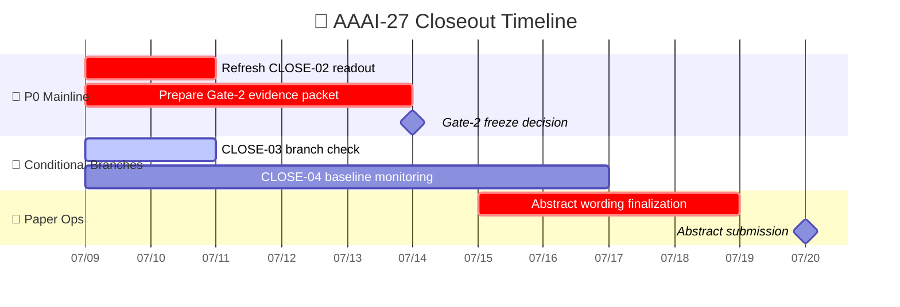

# AAAI-27 Closeout 状态与执行计划

_项目状态报告，基于 2026-07-09 当前工作区、closeout 账本、论文草稿与已落地 artifact 整理_

---

## 📝 TL;DR

- **主线已恢复：** 当前应继续推进的不是旧 `SPRINT-07`，而是 `issues/2026-07-06_evidence-priced-schedule-and-closeout.csv` 这条 closeout 主线。
- **今日第一优先级：** `CLOSE-02` 仍是最关键的 P0 行，因为它决定 ML1M Gate-1 红灯能否被归因为 host noise floor，并直接影响 2026-07-14 的 Gate-2 claim-strength 冻结。
- **论文已成型但未就绪：** `paper/main_v2.tex` 已具备可投稿草稿骨架，当前真实待填只剩 `2` 个 artifact-sensitive 位点，全部与 `CLOSE-02` 直接相关。
- **当前最安全口径不变：** 在新的 dated artifact 出来之前，论文与摘要必须继续按 Family D / weak-exit 默认口径推进，不能提前把 `CLOSE-02` 当成已解决。

## 📍 恢复上下文

- **恢复源：** `issues/2026-07-06_evidence-priced-schedule-and-closeout.csv`
- **严格闭环进度：** 1/13 行满足 `dev_state=已完成`、`review_initial_state=已完成`、`review_regression_state=已完成`、`git_state=已提交`
- **上一次完全闭环：** `CLOSE-01`，`SPRINT-07` 控制臂已收口，控制表已落地
- **当前恢复点：** `CLOSE-02`
- **上一层规范文档：** `docs/superpowers/specs/2026-07-06-evidence-priced-schedule-design.md`
- **当前 claim 边界：** `docs/reports/2026-07-04-family-d-claim-freeze-cn.md`

## 📊 当前状态

| 模块 | 当前状态 | 证据 | 对投稿的影响 |
| --- | --- | --- | --- |
| **Gate-1 官方案读数** | 已完成，`weak` 立即可达，`medium/strong` 当前不可达 | `docs/reports/data/2026-07-06-gate1/sprint05_gate1_report_zh.md` | 为 2026-07-14 Gate-2 冻结提供默认基线 |
| **SPRINT-07 v2 controls** | 已完成，`2 datasets x 4 arms` 表已落地 | `docs/reports/data/2026-07-06-sprint07/sprint07_control_report_zh.md` | 可支撑 control paragraph，不再是 blocker |
| **CLOSE-02 host noise floor** | 账本显示进行中；本地 dated 报告仍停在早期快照 | `docs/reports/data/2026-07-07-close02-ml1m-noise-floor/close02_ml1m_noise_floor_report_zh.md`；closeout CSV `CLOSE-02` 备注 | 是当前最关键 P0；不刷新就无法安全升级口径 |
| **CLOSE-03 Beauty corruption rerun** | 条件执行；仍受 `CLOSE-02` 和 GPU 空档约束 | closeout CSV `CLOSE-03` 备注 | 对 abstract 不是 blocker，对正文 robustness 叙事有帮助 |
| **CLOSE-04 external baseline** | 已选 `DiffuRec`，wrapper/launcher/tests 在本地存在，运行中 | `docs/reports/data/2026-07-07-close04-diffurec-choice-note.md` | 对 setup/appendix 有价值，但不是 7/20 abstract blocker |
| **CLOSE-06 abstract freeze** | 初审已完成，OpenReview 提交仍 pending | closeout CSV `CLOSE-06`；`paper/main_v2.tex` | 必须在 2026-07-18 前冻结文案，2026-07-20 提交 |
| **论文主稿** | 草稿骨架完整，fallback PDF 已存在 | `paper/main_v2.tex`、`paper/main_v2.pdf` | 可并行润色，但还不能宣称 submission-ready |
| **本地 closeout 工具链** | 关键脚本测试通过 | `tests.test_build_close02_ml1m_noise_floor_report`、`tests.test_build_sprint05_gate1_report`、`tests.test_build_sprint07_control_report`、`tests.test_run_close04_diffurec`、`tests.test_build_close04_external_baseline_table` | 说明今天的执行计划可直接落到脚本 |

## 🎯 优先级列表

### 1. `CLOSE-02`：刷新 host noise floor 的权威本地读数

**为什么是第一优先级**

- 它是当前唯一可能把 `Gate-1 ML1M delta=-0.015133` 重新解释为 “within host noise floor” 的 P0 证据行。
- 它直接决定 `CLOSE-05` 在 2026-07-14 是否只能冻结 `weak` 出口，还是存在升级到 `medium` 的可能。
- `paper/main_v2.tex` 里至少两处关键红灯文字仍显式依赖 `CLOSE-02`。

**今天的目标交付**

- 要么生成一份新的 dated `close02` 表/JSON/中文报告。
- 要么明确写出“本地 artifact 仍停在 2026-07-07 快照，不能据此改写论文”的状态说明。

**止损线**

- 在没有新的 dated artifact 前，不改 abstract 中关于 ML1M 红灯归因的保守句子。

### 2. `CLOSE-05`：提前准备 2026-07-14 Gate-2 冻结包

**为什么现在就要做**

- 当前证据默认只支持 `weak` 出口。
- 即使 `CLOSE-02` 未来升级，也只是把 Gate-2 从默认 `weak` 推向可讨论 `medium`，所以冻结包必须先按 `weak-default / medium-conditional` 准备。

**今天的目标交付**

- 整理一个 Gate-2 证据包清单：Gate-1 读数、SPRINT-07 控制表、Family D freeze memo、`CLOSE-02` 位置说明、`main_v2.tex` 中待替换句子位置。

### 3. `CLOSE-06`：保持 abstract freeze 的并行推进

**为什么不能等所有实验完再写**

- 2026-07-20 就要提交 abstract。
- 当前草稿已经能支撑 weak-exit 版本；真正需要等待的，只是 `CLOSE-02` 对 ML1M 噪声归因的最后一句话。

**今天的目标交付**

- 继续以 `paper/main_v2.tex` 为唯一主稿。
- 把 abstract 的“默认弱口径”和“若 `CLOSE-02` 通过则允许替换的一句升级语”分开管理。

### 4. `CLOSE-03`：把 Beauty corruption rerun 视为条件分支，不让它卡住主路径

**当前判断**

- 它仍有科研价值，但不是 abstract blocker。
- 如果 2026-07-10 前 L20 或 GPU 窗口不满足条件，应按账本规则收口为 documented gap，并保留第一代 corruption evidence。

### 5. `CLOSE-04`：继续把 DiffuRec 作为 protocol-context baseline 推进

**当前判断**

- baseline 已经选定为 `DiffuRec`，选择理由和 wrapper 路线已经清楚。
- 这条线对 setup / appendix 很有用，但在 2026-07-20 前不应挤占 `CLOSE-02` 和 `CLOSE-06` 的注意力。

## 🗓 执行时间线

## ⚠ 风险与阻塞

| 风险 | 级别 | 当前表现 | 缓解动作 |
| --- | --- | --- | --- |
| **`CLOSE-02` 本地 artifact 滞后** | 高 | dated 报告仍停在 2026-07-07 早期状态，但 closeout CSV 备注已写到 2026-07-08 seed100 final | 规划层可以参考账本；论文层只能引用新的 dated artifact |
| **L20 / GPU 外部状态不可直接由本地证明** | 高 | `CLOSE-03/04` 都依赖外部运行环境 | 在账本中保留 conditional/documented-gap 出口，不让其卡死 abstract |
| **`main_v2.tex` 仍有未回填占位符** | 高 | 当前真实待填位点为 `[659, 867]` | 把剩余位点继续按 owner 映射到 `CLOSE-02`，逐项清零 |
| **Gate-2 当前默认只能 weak** | 中 | Gate-1 artifact 已明确 `medium` 暂不可达 | 继续准备 weak-default 版本，等待 `CLOSE-02` 是否带来唯一可能的升级 |
| **closeout 账本严格闭环比例仍低** | 中 | 仅 `CLOSE-01` 严格闭环；多行虽推进但未 fully submitted | 先推进 P0 证据，再做 ledger/git 收口，避免为形式闭环牺牲主路径 |

## ✅ 下一步清单

- [ ] 检查是否已有新的 `CLOSE-02` dated artifact 同步到本地；若有，立即刷新本地噪声地板报告。
- [ ] 若没有新的 `CLOSE-02` artifact，则把 `main_v2.tex` 中依赖它的句子位置单独列出，准备 `weak-default / medium-conditional` 两套文案。
- [ ] 在 2026-07-10 前对 `CLOSE-03` 做一次条件判断：继续跑，还是 documented gap 收口。
- [ ] 继续保留 `CLOSE-04` 的 `DiffuRec` 监控，但不让它影响 2026-07-14 Gate-2 和 2026-07-20 abstract 节点。
- [ ] 2026-07-14 前把 Gate-2 冻结包整理成可直接审阅的证据集合。

## 🔆 今日结论

截至 2026-07-09，项目已经从“方法是否成立”转入“如何在 dated artifact 约束下把投稿主线稳稳收口”。当前真正的关键不是再扩展新实验面，而是把 `CLOSE-02` 这一条 P0 证据链刷新到足以支撑 Gate-2 与 abstract 冻结的状态；在它没有被新 artifact 明确刷新前，所有论文措辞都应继续服从 Family D 的保守边界。
