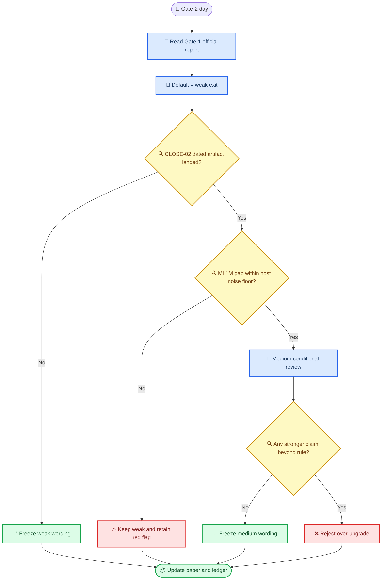

# Gate-2 冻结证据包

_面向 2026-07-14 `CLOSE-05` 的执行文档，基于当前 closeout 账本、Family D 冻结边界、Gate-1 官方案读数，以及 `CLOSE-02/03/04` 的已知工件状态整理_

---

## 📝 TL;DR

- Gate-2 不是“重判整篇论文”，而是按冻结规则在 `strong / medium / weak` 三个出口里**只能选一个**。
- 截至 2026-07-09，默认出口仍然是 `weak`。
- 唯一合法的升级路径是：`CLOSE-02` 给出 dated host noise-floor artifact，并证明 ML1M 的 `|-0.015133|` 缺口落在宿主噪声地板内。
- `CLOSE-03` 和 `CLOSE-04` 会影响正文完整度与 supporting evidence，但在当前规则下都**不是**把 `weak` 升到 `medium` 的硬门槛。

## 🎯 文档目的

这份文档只回答三件事：

1. 7/14 当天 Gate-2 必须读取哪些权威工件
2. 这些工件分别能改变什么、不能改变什么
3. 当天应该按什么顺序做决定，避免临场争论或越界升级

## 🗂 证据清单

| 证据 | 路径 | 当前状态 | 在 Gate-2 的作用 |
| --- | --- | --- | --- |
| Family D 冻结边界 | `docs/reports/2026-07-04-family-d-claim-freeze-cn.md` | 已冻结 | 限定可写主张上限 |
| Gate-1 官方案读数 | `docs/reports/data/2026-07-06-gate1/sprint05_gate1_report_zh.md` | 已落地 | 给出当前默认只能 `weak` 的基线判断 |
| SPRINT-07 v2 controls | `docs/reports/data/2026-07-06-sprint07/sprint07_control_report_zh.md` | 已落地 | 支撑机制段和 control paragraph |
| CLOSE-02 本地同步说明 | `docs/reports/data/2026-07-09-close02-ml1m-noise-floor-sync-note.md` | 已落地 | 解释为何目前仍不能把 ML1M 写成 within-noise |
| CLOSE-02 占位符与措辞补丁 | `docs/reports/2026-07-09-main-v2-placeholder-inventory-cn.md`、`docs/reports/2026-07-09-main-v2-wording-patches-cn.md` | 已落地 | 规定工件一回来如何改 `main_v2.tex` |
| CLOSE-03 腐蚀链 | 尚未形成新的 dated v2 工件 | 条件执行 | 影响 robustness 支撑，不决定 Gate-2 出口 |
| CLOSE-04 external baseline | `docs/reports/data/2026-07-07-close04-diffurec-choice-note.md` + 待运行结果表 | 选择已定、结果未定 | 影响 setup / appendix 完整度，不决定 `medium` 升级 |

## 🧱 证据与边界分层

Gate-2 当天有两类输入，必须严格区分：

### A. 出口判定证据

这些证据负责回答 “选 `strong / medium / weak` 中的哪一个”，并且应优先来自 `docs/reports/data/` 下的 dated artifact：

- `docs/reports/data/2026-07-06-gate1/sprint05_gate1_report_zh.md`
- `docs/reports/data/2026-07-06-sprint07/sprint07_control_report_zh.md`
- `docs/reports/data/2026-07-09-close02-ml1m-noise-floor-sync-note.md`
- 未来若落地：
  - 新的 `CLOSE-02` noise-floor report
  - 新的 `CLOSE-03` dated corruption report
  - 新的 `CLOSE-04` dated baseline table

### B. 写作边界文档

这些文档不决定出口本身，而是约束“出口选完以后最多能怎么写”：

- `docs/reports/2026-07-04-family-d-claim-freeze-cn.md`
- `docs/reports/2026-07-09-main-v2-wording-patches-cn.md`
- `docs/reports/2026-07-09-main-v2-placeholder-inventory-cn.md`

一句话说：

> **`docs/reports/data` 决定能选哪个出口；freeze memo 决定选完以后不能怎么乱写。**

## 📊 当前默认判定

根据 `docs/reports/data/2026-07-06-gate1/sprint05_gate1_report_zh.md`：

- `strong`: `not_reachable`
- `medium`: `not_reachable`
- `weak`: `reachable`

这意味着 Gate-2 当天的默认起点不是“开放讨论三档”，而是：

> **先假定 `weak`，只有在 `CLOSE-02` 给出新的 dated noise-floor artifact 后，才允许重新检查 `medium`。**

## 🔁 决策流程

## ✅ 唯一合法的升级路径

从当前规则看，`weak -> medium` 的合法升级只有一条：

1. `CLOSE-02` 生成新的 dated artifact
2. 该 artifact 含：
   - 至少 2-3 个 core seed 的最终值
   - `max pairwise abs delta`
   - report builder 产出的 `decision_line`
3. 该 artifact 支持：
   - `ML1M |-0.015133| <= measured host noise floor`

只有同时满足这三步，Gate-2 才能写：

- “ML1M 的 miss 在宿主噪声地板内”
- “`medium` 出口可被考虑”

否则都只能保留：

- “implementation red flag under investigation”
- “weak exit remains the only supported default”

## 🚫 明确不能作为升级依据的东西

以下证据即使存在，也**不能单独**把 Gate-2 从 `weak` 升到 `medium`：

- `seed100_final` 单种子结果
- `diag rerun` 单次 conditioned-arm 结果
- handoff playbook 里的操作结论
- `CLOSE-03` 腐蚀链结果
- `CLOSE-04` baseline 结果

原因很简单：这些都不是 `CLOSE-05` acceptance criteria 里允许替代 `CLOSE-02` noise-floor artifact 的对象。

## 🧩 对稿件的直接动作

Gate-2 当天只需要改三类地方：

### 1. `paper/main_v2.tex`

- `line 637` 附近：ML1M / ATG 红灯归因
- `line 845` 附近：limitations 里的噪声表述
- `line 646-649` 一带：是否启用 upgrade-only 句

### 2. `paper/main_v2_zh.md`

- 同步中英文口径，不允许英文升级而中文仍保留旧边界

### 3. closeout 账本

- `CLOSE-02`：补 `noise_floor` 与 `decision_line`
- `CLOSE-05`：记录最终出口
- 必要时 `CLOSE-06/07`：同步“可改 abstract / full-paper wording”的状态

## 📋 7/14 当天执行清单

- [ ] 先读 Gate-1 官方案读数，确认默认出口仍是 `weak`
- [ ] 检查本地是否已有新的 `CLOSE-02` dated artifact
- [ ] 若无新工件：直接冻结 `weak`
- [ ] 若有新工件：按噪声地板规则判断是否允许 `medium`
- [ ] 用 `2026-07-09-main-v2-wording-patches-cn.md` 选对应英文句块
- [ ] 更新 `main_v2.tex`、中文镜像稿与 closeout 账本
- [ ] 在 Gate-2 报告里明确写出“为什么不是更强出口”

## 🔆 结论

Gate-2 不是一个开放式写作讨论，而是一个规则驱动的冻结节点。当前最重要的不是构思更强的说法，而是保证 7/14 当天只根据**dated artifact** 做最小必要改动：没有新的 `CLOSE-02` 工件，就冻结 `weak`；有新的 `CLOSE-02` 工件，再按噪声地板规则判断是否允许进入 `medium-conditional`。
