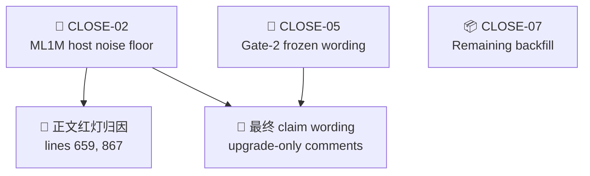
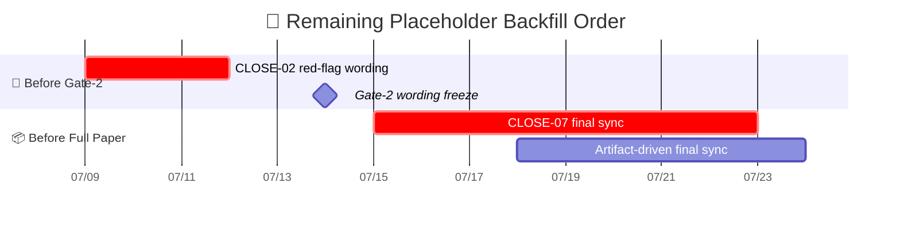

# main\_v2 占位符清单

_面向 AAAI-27 closeout 的论文回填清单，基于 2026-07-09 当前 `paper/main_v2.tex`、closeout 账本与本地 artifact 盘点_

---

## 📝 TL;DR

- `paper/main_v2.tex` 当前**尚未回填的真实 `\pending{}` 只剩 2 处**。
- `\pnum` 目前没有落在正文或附录的实际内容单元里，只保留了宏定义。
- 真正阻塞正文主叙事的核心占位现在只剩一组：`CLOSE-02` 的 ML1M host noise floor 归因。
- `CLOSE-07` 已经完成一轮 appendix 正文合并，并且已经补完 implementation / supplement 基础说明：`Proofs`、`Scope and boundary conditions`、`First-generation instantiation`、`Negative results`、`Implementation and infrastructure` 都不再是空占位；当前剩余风险收缩到数据集统计表和 `CLOSE-02` 红灯归因。
- `CLOSE-05` 不是通过单个 `\pending{}` 出现，而是通过正文中的 upgrade-only 注释和 claim 语句控制最终改写范围。

## 📍 盘点范围

- 主稿：`paper/main_v2.tex`
- 中文镜像：`paper/main_v2_zh.md`
- closeout 账本：`issues/2026-07-06_evidence-priced-schedule-and-closeout.csv`
- closeout 设计：`docs/superpowers/specs/2026-07-06-evidence-priced-schedule-design.md`
- Family D 冻结边界：`docs/reports/2026-07-04-family-d-claim-freeze-cn.md`

## 📊 占位符总览

| 类别 | 数量 | 主要 owner | 影响范围 |
| --- | ---: | --- | --- |
| 内容中的 `\pending{}` | 3 | `CLOSE-02`、`CLOSE-07` | setup、validation 归因 |
| 内容中的 `\pnum` | 0 | 无 | 当前正文与附录无实际 `\pnum` 占位 |
| 宏定义保留 | 2 | `\pending` / `\pnum` 宏仍在导言区 | 供后续回填继续使用 |

## 🔢 行级清单

| 行号 | 占位符摘要 | owner | 所需权威 artifact | 当前状态 | 对投稿的影响 |
| ---: | --- | --- | --- | --- | --- |
| 659 | ML1M host noise floor 归因 | `CLOSE-02` | dated noise-floor artifact（2-3 seeds） | 当前本地只有早期快照，账本有较新 `seed100_final` 备注 | 当前最关键正文 blocker |
| 867 | limitations 中的 `CLOSE-02 artifact` 占位 | `CLOSE-02` | 同上 | 同上 | 影响 limitation 中对红灯的最终措辞 |

## ✅ 已完成的 appendix 合并

以下原先属于 `CLOSE-07` 的 appendix 占位已经从冻结稿 `paper/main.tex` 合回主稿：

- `Proofs`
- `Scope and boundary conditions`
- `First-generation instantiation`
- `Implementation and infrastructure`
- `Negative results`

这意味着 `CLOSE-07` 当前不再是“整段附录仍空着”，而是“本地主体写作回填基本完成，剩余只是在等少量 dated artifact 做最终同步”。

## 🪞 中文镜像对账

`paper/main_v2_zh.md` 不是投稿母本，但仍是作者审阅导航页。当前最重要的约束是：

- 英文主稿始终是唯一投稿母本
- 中文镜像可以滞后于英文本体的 appendix 回填
- 但在 claim-sensitive 位置上，中文镜像不能先于英文主稿擅自升级口径

## 🔗 关键依赖关系

## ⚠ 当前最该盯的三处

### 1. `CLOSE-02`

- 正文位置：`paper/main_v2.tex:659`
- limitations 位置：`paper/main_v2.tex:867`

当前最诚实状态：

- Gate-1 官方案读数已固定：`ML1M delta_test_p2_ndcg10 = -0.015133`
- 本地 dated `close02` 报告仍停在 2026-07-07
- closeout 账本备注已记录到 2026-07-08 的 `seed100_final`

写作纪律：

- 在新的 dated noise-floor artifact 落地前，不能把正文改成 “within noise”
- 最多只能保留 “under investigation / host noise floor pending” 一类表述

### 2. `CLOSE-07`

当前剩余本地回填动作已经收缩为：

1. 其余依赖远端 dated artifact 的红灯归因联动

附录主干正文已经不再是当前瓶颈。

## 🗓 回填顺序建议

## ✅ 可立即并行推进的写作动作

- [ ] 保持 `lines 659 / 867` 的 `weak-default` 版本，直到 `CLOSE-02` dated artifact 落地
- [x] 将 baseline setup 句固定为 “DiffuRec 已选定，若结果窗关闭则显式报缺”
- [x] 从冻结版 `paper/main.tex` 合并 appendix proofs / boundary / first-generation / negative-results 正文
- [ ] 等 `CLOSE-02` 工件落地后，做最后一轮 artifact-driven 同步

## 🔆 结论

现在 `main_v2` 的局面已经比之前更收口了：不是整篇论文都在等实验，而是只剩 2 个真正的回填位点在等工件。换句话说，closeout 的写作主线已经从“补整段内容”切到了“等 `CLOSE-02` 的少数关键 artifact 再替换最后两处红灯句子”。
