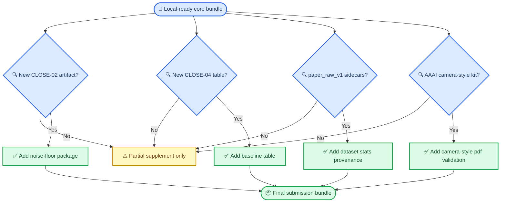

# Supplement Bundle 清单

_日期：2026-07-09_
_用途：为 `CLOSE-07` 提供本地可执行的 supplementary / reproducibility bundle 清单，区分已具备材料与仍缺的远端或外部工件_

---

## 📝 一句话结论

截至 2026-07-09，本地已经具备一份可信的 supplementary 打包骨架：主稿、中文镜像、参考文献、fallback PDF、主路径图、关键 closeout 审计文档、以及若干脚本与主表 artifact 都在仓库里。但它还不是可直接提交的最终补充材料，因为仍缺三类关键工件：新的 `CLOSE-02` dated noise-floor artifact、`CLOSE-04` 的正式 baseline 结果表，以及 `paper_raw_v1` 的权威 regenerated sidecar。

## 📦 目标范围

这份清单只针对 full paper / supplementary 阶段需要一起打包的材料，不覆盖 abstract-only 阶段。

目标是让后续执行者能回答：

1. 本地已经有哪些可以直接纳入 bundle
2. 哪些只能在远端工件同步后再纳入
3. 哪些外部条件仍然阻止 camera-style 最终提交包闭合

## ✅ 当前本地已具备的材料

### A. 论文母本层

| 材料 | 路径 | 当前状态 |
| --- | --- | --- |
| 英文主稿 | `paper/main_v2.tex` | 已存在，当前只剩 2 个 artifact-sensitive 占位 |
| 中文镜像稿 | `paper/main_v2_zh.md` | 已存在，继续作为作者审阅页 |
| fallback PDF | `paper/main_v2.pdf` | 已存在，article-mode 编译通过 |
| 参考文献 | `paper/references.bib` | 已存在 |

### B. 图与图层层

| 材料 | 路径 | 当前状态 |
| --- | --- | --- |
| fallback figure set | `docs/reports/figures/main_path_paper/` | 4 张 PNG + 4 张 SVG 已存在 |
| 图层说明 | `docs/reports/figures/main_path_paper/README.md` | 已存在 |

### C. closeout 核心证据层

| 材料 | 路径 | 当前状态 |
| --- | --- | --- |
| Gate-1 官方案读数 | `docs/reports/data/2026-07-06-gate1/` | 已本地落地 |
| Sprint-07 v2 controls | `docs/reports/data/2026-07-06-sprint07/` | 已本地落地 |
| CLOSE-02 本地同步说明 | `docs/reports/data/2026-07-09-close02-ml1m-noise-floor-sync-note.md` | 已存在 |
| CLOSE-04 协议审计 | `docs/reports/data/2026-07-09-close04-protocol-audit.md` | 已存在 |
| main\_v2 数值来源审计 | `docs/reports/data/2026-07-09-main-v2-numeric-provenance-audit.md` | 已存在 |
| main\_v2 文案回归审计 | `docs/reports/data/2026-07-09-main-v2-regression-wording-audit.md` | 已存在 |
| dataset-stats 来源审计 | `docs/reports/data/2026-07-09-dataset-stats-source-audit.md` | 已存在 |

### D. 可随补充材料一并提供的脚本层

至少已存在以下直接服务 closeout 的脚本：

- `scripts/build_close02_ml1m_noise_floor_report.py`
- `scripts/launch_close02_ml1m_noise_floor_tmux.py`
- `scripts/run_close04_diffurec.py`
- `scripts/build_close04_external_baseline_table.py`
- `scripts/launch_close04_diffurec_tmux.py`
- `scripts/build_sprint05_gate1_report.py`
- `scripts/build_sprint07_control_report.py`
- `scripts/generate_main_path_paper_figures.py`

## ⚠ 当前仍缺的关键材料

### 1. `CLOSE-02` 正式 dated noise-floor artifact

本地目前只有：

- `2026-07-06-close02-ml1m-noise-floor/`
- `2026-07-07-close02-ml1m-noise-floor/`

还没有：

- 新的 dated `close02_ml1m_noise_floor_report.*`
- 完整三种子 `max pairwise abs delta`
- 最终 `decision_line`

### 2. `CLOSE-04` 正式 baseline 结果表

本地已有：

- `DiffuRec` 选择说明
- wrapper 协议一致性审计
- 本地测试与 smoke evidence

但还没有：

- 四数据集正式 baseline-vs-host-vs-ours 表

### 3. `paper_raw_v1` 权威 sidecar

本地没有：

- `dataset/paper_raw_v1/*/protocol.json`
- `item_mapping.csv`
- regenerated split provenance sidecar

这直接阻止了 setup 里“数据集统计表”的诚实回填。

### 4. camera-style 编译环境闭环

当前已知：

- fallback `main_v2.pdf` 已存在
- Tectonic article-mode 编译已成功

仍未知 / 未完成：

- `aaai27.sty`
- `aaai27.bst`
- camera-style 页数与匿名版式最终核查

## 🔁 supplementary 打包依赖图

## 📋 当前可执行的 bundle 结构

如果今天就要打一个“本地补充材料预览包”，最合理的结构是：

1. `paper/`
   - `main_v2.tex`
   - `main_v2.pdf`
   - `main_v2_zh.md`
   - `references.bib`
2. `docs/reports/figures/main_path_paper/`
3. `docs/reports/data/2026-07-06-gate1/`
4. `docs/reports/data/2026-07-06-sprint07/`
5. `docs/reports/data/2026-07-09-*.md`
   - protocol audit
   - placeholder inventory
   - wording patch
   - abstract freeze candidate
   - numeric provenance audit
   - wording regression audit
   - dataset-stats source audit
6. `scripts/`
   - close02 / close04 / gate1 / sprint07 / figures 相关脚本

## 🚫 当前不应假装已经在 bundle 里的东西

- 新的 `CLOSE-02` noise-floor report
- 正式四数据集 DiffuRec 结果表
- regenerated `paper_raw_v1` sidecar
- camera-style 最终 PDF 版式验证

## 🔆 结论

当前 supplementary 不是“从零开始没法打包”，而是“主体骨架已经有了，但还缺 4 类关键收口工件”。所以后续最稳妥的做法不是重新讨论 bundle 长什么样，而是把这份清单当成缺口表，等 `CLOSE-02`、`CLOSE-04`、`paper_raw_v1` sidecar、以及 `aaai27` camera-style 条件到位后逐项补齐。
