# PreferGrow 当前实验进展与投稿实验规划

_PreferGrow AAAI-27；2026-07-11；第一性原理、证据分级与可执行补充实验说明。_

---

## 📌 研究问题与证据边界

本项目研究的不是“把文本编码器接到推荐器上是否总能提升 NDCG”，而是一个更具体的机制问题：在离散偏好扩散推荐中，冻结文本证据被注入 forward corruption proposal 时，文本对真实 next item 的预测性是否会增加 false-negative pollution；如果会，能否用 train-only 的 `U_ds` 预检、null-calibrated `u_tilde` 和唯一 gate `g` 在 kernel 层限制这种风险，并在 `g=0` 时精确回退到 host proposal。第一性原理要求把结论拆成连续因果链：

```text
train-only text evidence
        ↓
U_ds / phi preflight
        ↓
proposal gate changes forward transition law
        ↓
false-negative pollution changes optimization signal
        ↓
full-catalog ranking metric changes
        ↓
cross-domain and baseline claims
```

因此，单元测试、manifest validator、no-training smoke 和 kernel lockstep trace 可以证明“实现是否遵守契约”，却不能单独证明“方法是否提升推荐”。本报告使用五级证据标签：`artifact-proven`（dated 工件与 hash 可复核）、`single-run observation`（一次真实训练的观测）、`engineering contract`（工程/实现验证）、`in-progress`（已启动但尚未完成）、`not-started`（尚未运行）。单 seed 结果一律只能称为 single-run result/observation，不使用 significant、stable、statistically equivalent 或 within noise。

## ✅ 已完成的实验与工程验证

### 1. Gate-0：四域 train-only 文本效用预检

目的是真正测量冻结文本 bank 对 next item 的预测性，而不是把文本质量假定为有益。方法是对每条 train transition 使用 100 个 train-next popularity negatives 计算 `U_ds(popularity)=P(sim(h,next)>sim(h,neg_pop))`，并保留 100 个 uniform negatives 作为诊断统计；随后用预注册 hinge 得到 `phi(U_ds)`。没有读取 validation/test target，因此这一步只回答“输入证据是否可靠”，不回答推荐性能。

| 数据集 | `U_ds(popularity)` | `U_ds(uniform)` | `phi(U_ds)` |
|---|---:|---:|---:|
| ML1M | 0.753539 | 0.798526 | 0.000000 |
| Steam | 0.569566 | 0.565079 | 1.000000 |
| Beauty | 0.712428 | 0.717204 | 0.000000 |
| ATG | 0.688262 | 0.692013 | 0.117375 |

排序为 `ML1M > Beauty > ATG > Steam`；四个 aggregate 点中，ML1M 的 gate 关闭，Steam 的 gate 打开，Beauty/ATG 未同时进入明显开门区。该结果支持“文本效用可能与 corruption 风险相关”的描述性输入假设，但不支持总体因果效应：没有用户级 bootstrap CI、没有多 seed，也没有把 `U_ds` 与同一 revision 的最终 full-catalog delta 做预注册统计关联。来源为 [Gate-0 utility report](data/2026-07-02-gate0/gate0_text_utility_report.json) 与 [中文摘要](data/2026-07-02-gate0/gate0_text_utility_report_zh.md)。

### 2. E0：尾批 evaluator 修正与全方法同尺重评

E0 的目的不是选择有利数字，而是修复 `history` 尾批过滤后，用同一 evaluator 重新评估 host、ours、controls 以及 provenance 中的 DiffuRec 行，保留旧数字并生成新旧对照。四域实际评估行数为 Steam `80,651`、ML1M `85,405`、Beauty `2,237`、ATG `1,942`；修正后的 Gate-1 `delta_test_p2_ndcg10` 为：Steam `+0.0021423065`、ML1M `-0.0148505330`、Beauty `-0.0037048671`、ATG `-0.0115052014`。四项冻结判据均未翻转：Steam 仍未达到预注册的 `+0.003` reference magnitude，ML1M/ATG 仍 miss，Beauty 仍满足 `abs(delta)<0.01`。

E0 支撑的是测量一致性和结果审计，不是方法 efficacy。尤其要区分：DiffuRec 的 provenance 行证明过 evaluator 可以处理该方法的历史结果，但当前 confirmatory comparison 已按用户决定排除 DiffuRec；DiffRec 也没有在本项目按共同协议复现。因此，E0 不能被写成“已有公平外部 baseline”。来源为 [E0 amendment](data/2026-07-10-evaluator-amendment/e0_evaluator_amendment.md) 及其 [中文对照表](data/2026-07-10-evaluator-amendment/e0_evaluator_amendment_zh.md)。

### 3. Gate-1 legacy 四域单次方向性观测

该实验在旧流程中比较 frozen host 与 ours/full，观察文本注入对四域 NDCG@10 的方向。E0 统一重评后，Steam 的增量为 `+0.002142`，Beauty 为 `-0.003705`，ML1M 为 `-0.014851`，ATG 为 `-0.011505`。这是一次单 seed、开发期 test metrics 被记录的方向性观测，不能给出显著性、稳定性或跨总体泛化结论。它反而暴露了主张需要补强的地方：结果不是四域一致提升，必须补充 gate attribution、外部 baseline 与多 seed，而不是只展示 Steam 的正号。

### 4. E1/R12：`g=0` kernel 与 ownership lockstep trace

E1/R12 的目的在于验证关闭 gate 时，proposal、forward corruption、score-entropy 与 analytic reverse 四条路径是否真正回退同一 host 张量，并确认 graph-owned host `p1` 在 optimizer、EMA、checkpoint 和 common evaluator 中没有丢失。指定 revision `0338cc2…`、Beauty、seed `100` 下，在 steps `0,1,100,1000` 对 host、final-v2 与 global-p 三条路径执行 FP32 tolerance `1e-6` 的 `2,986` 项比较，`failed_comparisons=0`、`first_divergence=null`。

这证明了指定 revision 的实现契约和参数 ownership，不证明 standalone checkpoint 的推荐指标等价，更不证明文本 gate 在训练后提升 NDCG。来源为 [R12 trace](data/2026-07-11-e01-gzero-production-trace-r12/e01_gzero_trace.json) 和 [R12 scope amendment](data/2026-07-11-e01-r12-ownership-scope-amendment/e01_r12_ownership_scope_amendment.md)。

### 5. RISK-04：Steam severe corruption train-only preflight

资产实验先生成 Beauty/Steam 六个 corruption level（0/20/40/60/80/100），再对 Steam popularity-stratified 60% item-embedding permutation 做 severe gate；使用 seed `100`、train transitions 和 clean embeddings，不能使用 validation/test。clean mean gate 为 `0.1173063980`，Steam c60 为 `0.0858376137`，相对下降

`(0.1173063980-0.0858376137)/0.1173063980 = 0.2682614493`，即 `26.826%`，超过固定 `20%` 训练启动门。12 个 bank、item order、row norm、源文件 hash 和 train-only provenance 已绑定到 dated RISK-04 PASS bundle。

这个结果只授权后续 controlled pilot，不能写成“severe corruption 下模型性能下降 26.8%”，因为它测的是 gate preflight statistic，不是 recommendation metric。来源为 [RISK-04 finalization](data/2026-07-11-risk04-gate-finalization/attempt_manifest.json)。

### 6. RISK-05：受控 corruption 的 `phi_R` 冻结

RISK-05 将 `phi_R=clip((R_100-R_D)/(R_100-R_clean),0,1)` 作为 Beauty/Steam pilot 的操纵量，而不是替代论文主方法的 `phi(U_ds)`。冻结值为 Beauty `c0=1.0,c60=0.1366311174,c100=0.0`，Steam `c0=1.0,c60=0.0580811027,c100=0.0`；实验矩阵为 E1-pass 14 个 task 与 E1-fail-audit 8 个 task，evaluator `e0_full_tail_v2`，selector `validation-ndcg10-rowweighted-v1`，seed `100`，`max_attempts=1`、`fail_closed`。这完成的是 preregistration 和 provenance 绑定，不是 pilot efficacy。来源为 [RISK-05 amendment](data/2026-07-11-risk05-implementation-amendment-r5/implementation_amendment.md)。

### 7. r3/r4/r5 fail-closed 审计

这些是已经完成的工程诊断实验，必须作为审计证据而非性能结果使用。

| Attempt | 观察 | 科学解释 |
|---|---|---|
| r3 | `2 passed / 2 failed / 18 pending`；host 为 hybrid identity，anchor/full 出现路径或 `phi_R` 问题；没有 full arm、没有 RISK-08 | 证明旧队列不能作为 repaired-host 结果 |
| r4 | manifest 构建成功但四个 host 仍是 `graph.type=hybrid`；controller 未启动、training steps 为 0 | 证明 host identity 需要在 validator 层硬约束 |
| r5 | 7 个 task 在 Hydra logging 前失败，15 个未启动，0 steps、0 checkpoints、0 summaries；另有一次 GPU0 错派 | 证明 source `cwd` 与 GPU allowlist 必须机械隔离；r5 永久不可 retry |

来源为 [r3 audit](data/2026-07-11-risk0607-r3-fail-closed-audit/risk0607_r3_fail_closed_audit.md)、[r4 audit](data/2026-07-11-risk0607-r4-prelaunch-host-identity-audit/risk0607_r4_prelaunch_host_identity_audit.md) 和 [r5 live-startup audit](data/2026-07-11-risk0607-r5-live-startup-fail-closed-audit/risk0607_r5_live_startup_fail_closed_audit.md)。

### 8. r6 启动契约的本地与资源验证

r6 尚未产生新的训练结果，但其代码链已完成一轮新鲜工程验证：扩展回归 `156` tests、`0` failures、`0` errors、`1` Windows `flock` skip；`compileall` 与 `git diff --check` 均返回 `0`。生成 manifest invariant audit 得到 `22` tasks、`14/8` 分支、`gpu_ids=[1]`、seed set `{100}`、22 个唯一 run directory、每个 GPU task `cwd==run_dir`、4 个 host 与 18 个 evidence task、绝对 POSIX source entry。l20 的 20 秒 CUDA-only probe 以 `CUDA_VISIBLE_DEVICES=1` 启动 PID `2891985`，全局 PID 行和 `--id=1` 均只出现该 PID，`--id=0` 为空，进程自然退出；这仍只是资源/启动证据。真正的 production `probe_gpu_pids(0/1)` 和 Hydra startup probe 必须在新 immutable r6 source 部署后执行。完整记录见 [r6 contract verification](data/2026-07-11-r6-runtime-launch-contract/verification.md)。

## ⚠️ 尚缺的必要实验

从因果链看，当前已有“输入证据”和“实现契约”，但缺少“真实训练结果—外部参照—重复性”三个中间环节。缺口及其第一性原理理由如下：

| 缺口 | 当前状态 | 为什么不能省略 |
|---|---|---|
| r6 真实 Hydra startup probe 与 Beauty/Steam pilot | 未开始 | 没有真实 dataloader 前的无副作用探针，就无法排除 r5 类 runtime failure；没有 pilot artifact 就没有 RISK-08 |
| final-v2 四域 matched host/full | 未完成 | E0 只重评历史 artifacts，不能证明修复后的 host `p1` 与 final-v2 在四域真实训练中如何作用 |
| SASRec 四域 external baseline | 未开始 | 没有非扩散参照，无法区分“方法机制发现”与“只是本模型内部差异”；AAAI 审稿人也无法判断结果尺度 |
| ATG attribution 与 Steam severe efficacy | 未完成 | 若没有 global-p、u-shuffle、dataset-gate-only 等控制，负向/正向变化可能来自数据集、门常数或随机 bank，而非 `U_ds` gate |
| 三 seed matched rerun | 未完成 | 单次随机初始化不能估计 seed dispersion；无法报告均值、区间或重复性，只能做方向性 observation |
| `U_ds` user-cluster bootstrap 与 additional datasets | E7 曾 hard-stop | 四个 aggregate 点不足以支撑 population-level inversion；需要冻结 transition-user records、≥1000 reps、95% CI 和 order retention |
| efficiency audit | 未开始 | 若论文声称可部署或成本可接受，必须记录 wall time、GPU-hours、峰值显存、磁盘增长和 step throughput |
| 统计推断与多重比较 | 未完成 | 目前没有预先定义的 effect-size/CI/p-value 汇总；不能把相邻数据集差异或单 seed 方向写成显著结果 |

Prospective holdout 本轮按用户批准不新增，但论文必须保留 test 开发期记录的披露，不得把 test 称为 untouched final holdout。DiffuRec 不再作为 confirmatory baseline；DiffRec 若没有共同协议的四域运行，也只能在 related/audit limitation 中说明。

## 🎯 投稿前必须补充的实验设计

以下五项是“稳妥投稿线”的最低集合；其中 P0 是没有它就难以支撑主结论的实验，P1 是强烈建议在摘要冻结前完成的验证。所有新增训练和 corruption 固定 seed `100`，先单 seed，后续多 seed 另行授权。

### P0-1：r6 real startup probe + RISK-06/07 pilot

**假设机制：** 修复后的运行时把代码身份与可写 runtime state 分离，真实 Hydra 可以在 `cwd=run_dir` 完成 logging、dataset reconciliation、graph/model/noise、optimizer/EMA、strict bank/null/`phi_R` 构造，并在第一步前无副作用退出。

**操作步骤：** 从新的 immutable source 建立 dated r6 root；用 Beauty full-c60 做独立 probe，`CUDA_VISIBLE_DEVICES=1`、Hydra `cuda=1`、seed=100、真实 argv/env/assets，追加 `training.startup_probe_only=True`；核对 `STARTUP_PROBE_PASS`、`startup_probe.json`、step=0、optimizer state=0、无 dataloader/optimizer.step/checkpoint/summary/metric；只有探针通过才创建 GPU1-only resident controller，执行 14 pass 与 8 audit task。

**定量验收：** 22 tasks 可验证，`gpu_ids=[1]`，GPU task 全部 `cwd==run_dir`，单卡最多一个新进程，`/data>40 GiB`，probe exit code=0，probe artifact/log 在 probe run_dir 内，probe checkpoint/summary 数为 0；随后至少有一个 task 在日志中进入真实 training loop。这里的验收是运行有效性，不预先承诺 NDCG 方向。

**填补空白：** 把 r5 的“对象 smoke 通过但真实 Hydra 失败”替换为可审计的端到端启动证据，并让后续 pilot 结果具备 RISK-08 输入资格。预计 GPU 资源按冻结 manifest forecast 约 56–80 GPU-h，GPU1 串行；startup probe 本身只需分钟级 CPU/GPU 初始化。

### P0-2：SASRec 四域 atomic external baseline

**假设机制：** 如果 PreferGrow 的现象不是离散扩散内部的 evaluator/数据处理伪影，至少应在共同 split、mapping、full-catalog evaluator 和 validation-only selector 下与一个经典 sequential recommender 形成可解释参照。

**操作步骤：** 固定 Steam、ML1M、Beauty、ATG 四域、seed=100；实现或复现原论文配置的 SASRec，不使用 test 选模；四个数据集作为 atomic group 一次提交，记录参数、训练步、checkpoint、validation-selected summary、test log、split/evaluator/selector hash。

**定量验收：** 四域必须全部有真实 artifact；Table 4 同时报告 NDCG@10、HR@10、参数量、训练时长和 evaluator version。若任一域失败，整组标为 incomplete，不得只报告有利子集；单 seed 只能写 single-run observation。预计 2–8 GPU-h，单张卡可串行。

**填补空白：** 提供非扩散 external anchor，区分“方法机制导致的风险变化”与“本项目扩散模型本身的尺度/实现差异”。

### P0-3：final-v2 四域 matched host/full rerun

**假设机制：** train-only `U_ds` 越高，proposal-side text injection 越容易造成负向或较弱 delta；gate 关闭的数据集应接近 host，而低 utility 数据集才有机会显示正向变化。

**操作步骤：** 用 E0 修正后的共同 evaluator 重跑四域 host 与 final-v2 full；固定 validation-only selector、相同 catalog/mapping、同一 seed=100，保存每个用户/row 的 validation/test 记录；将 `U_ds`、`phi`、mean gate、delta 和 artifact hash 写入同一 manifest。

**定量验收：** 四域各有 host/full 成对结果，报告绝对 delta 与相对 delta，且每个 domain 的 row count 与 E0 期望值一致。预注册方向只作为检验，不许事后改阈值；若结果混合，原样报告 mixed observation，并将 efficacy 限定为 exploratory/mechanistic，不把失败改写为成功。

**填补空白：** E0 解决了“尺子是否一致”，该实验才回答“修复后的实现是否在真实训练中呈现预注册机制”。预计 16–32 GPU-h，GPU1 串行。

### P1-4：ATG attribution + Steam severe corruption response

**假设机制：** 真正起作用的是 `U_ds` 驱动的 proposal gate，而不是常数 gate、dataset-only scaling、global popularity 或随机 shuffle。

**操作步骤：** ATG 至少运行 host、global-p、u-shuffle、dataset-gate-only、risk-gated-full 五个预注册 arms；Steam 运行 clean/c60 的 host、anchor-only、risk-gated-full，并复用已 hash 的 popularity-stratified 60% bank。所有 arms 使用相同 split、evaluator、selector 与 seed=100；不在门判失败后启用 adaptive backoff。

**定量验收：** 先检查 severe preflight 的固定 `relative_clean_drop≥0.20`；再比较各 arm 的 mean gate、EPE、NDCG@10/HR@10 和 delta。成功标准不是“每个结果都提升”，而是控制组与 full 的差异方向符合预注册机制、所有 arm 都有 artifact、没有 hash/selector 漂移；若控制组与 full 同向，必须把机制解释降级为待确认。预计 4–12 GPU-h。

**填补空白：** 排除数据集规模、global popularity、随机 embedding 与常数 gate 的替代解释，使“可靠性反向决定 corruption 风险”从相关描述更接近机制证据。

### P1-5：三 seed matched rerun 与 `U_ds` uncertainty

**假设机制：** 主要方向不应只由一次随机初始化决定；同时，四域 `U_ds` 排序与 gate 方向应在 user-cluster bootstrap 下保持到可解释程度。

**操作步骤：** 在单 seed 通过后追加 seed 101/102，复用同一 code revision、assets、split、selector/evaluator；对冻结 transition-user records 做 ≥1000 次 user-cluster bootstrap，不重新读取 test target、不重新采样 bank。报告 seed-level mean/std、95% CI、order retention 与每个 domain 的 paired delta。

**定量验收：** Table 6 必须列出每个 domain 的 `n_seed=3`、均值、标准差、95% CI 和缺失记录；bootstrap 输出 order retention 与 CI。CI 或排序不稳定不是失败，而是对论文结论的限制；在此之前禁止 stable/statistically equivalent 等措辞。三 seed matched pilot 粗估 24–96 GPU-h；bootstrap CPU 约 1–4 h。

**填补空白：** 将单次 descriptive inversion 降低为可量化的不确定性陈述，避免把 4 个 aggregate 点或 `p=1/24` 描述性 exchangeability 计算误写成总体概率。

### P2-6：效率与可复现性审计

**假设机制：** fallback-safe gate 的额外成本应可被记录且不会产生不可接受的显存/磁盘负担。

**操作步骤：** 从 controller/event logs 读取每个 task 的 wall time、GPU seconds、峰值显存、step throughput、输出大小、checkpoint 保留策略和失败原因；与 host-only 对照使用同一硬件和 batch 配置。

**定量验收：** Table 7 至少包含 wall hours、GPU-hours、peak VRAM、disk delta、训练步数和有效 artifact 数；任何数字都回指真实日志 hash。预计 2–6 GPU-h；若未做，不在论文中声称“efficient”或“deployment-ready”。

## 🔗 实验必要性与结论因果链

下图建议作为论文方法—证据关系图；它把每一层能证明的命题与不能证明的命题分开。

```mermaid
flowchart LR
    accTitle: PreferGrow evidence chain
    accDescr: Train-only text evidence is converted into a proposal gate, implemented with exact fallback, tested in a real queue, compared with an external baseline, and only then generalized with seeds and uncertainty.

    train_evidence["Train-only U_ds"] --> gate_rule["Preflight phi and gate"]
    gate_rule --> kernel["Proposal transition kernel"]
    kernel --> fallback["g=0 exact host fallback"]
    fallback --> startup["Real Hydra startup probe"]
    startup --> pilot["RISK-06/07 pilot"]
    pilot --> baseline["SASRec four-domain baseline"]
    baseline --> repeat["Three-seed and bootstrap"]
    repeat --> conclusion["Bounded AAAI conclusion"]
    audit_fail["r3/r4/r5 fail-closed audits"] -.-> startup
    controls["ATG attribution and Steam c60"] -.-> pilot

    classDef input fill:#dbeafe,stroke:#2563eb,stroke-width:2px,color:#1e3a5f
    classDef gate fill:#fef3c7,stroke:#d97706,stroke-width:2px,color:#78350f
    classDef audit fill:#fee2e2,stroke:#dc2626,stroke-width:2px,color:#7f1d1d
    classDef evidence fill:#dcfce7,stroke:#16a34a,stroke-width:2px,color:#14532d
    class train_evidence input
    class gate_rule,kernel gate
    class fallback,startup,pilot,baseline,repeat,conclusion,controls evidence
    class audit_fail audit
```



第一条链已经完成到 `fallback`：Gate-0 给出 train-only 输入，E1/R12 给出指定 revision 的实现等价，RISK-04/05 给出 corruption 资产和操纵量冻结。它还没有越过 `startup → pilot`，所以不能说“方法在推荐任务上有效”。r3/r4/r5 的失败审计虽然没有提供性能，却直接证明真实队列和 source/runtime 隔离是必要的；没有它们，后续数字即使出现也可能来自错误 host、错误 bank 或错误 GPU。

`pilot → baseline` 是外部可解释性链：pilot 告诉我们 gate 在预注册 corruption 条件下如何工作，SASRec 告诉我们这种现象是否超出扩散模型内部参照。缺少 SASRec，主表没有公平比较对象；缺少 attribution，无法排除 global-p 或 dataset-only scaling；缺少三 seed/bootstrap，无法从单次观测推进到统计结论；缺少效率审计，不能声称实际可部署。

### 当前可以写入论文的结论

- 可以写：E0 修正保留旧数字并对全方法同尺重评，四域行数和 Gate-0/Gate-1 判据未翻转。
- 可以写：在指定 revision、Beauty、seed=100 的 R12 trace 中，2986 项 `g=0` 路径比较全部通过；这是 implementation evidence。
- 可以写：Steam severe train-only preflight 的 mean gate 相对 clean 下降 26.826%，因此授权 controlled pilot；这是 preflight authorization。
- 可以写：r3/r4/r5 暴露了 source cwd、host identity 与 GPU allowlist 风险，均按 fail-closed 关闭且没有性能证据。

### 当前不能写入论文的结论

- 不能写 PreferGrow 在四个数据集上普遍提升 NDCG/HR，或优于 SASRec；SASRec 四域运行尚未开始。
- 不能写 gate 的效果“显著、稳定、等价于 host”或“within noise”；当前主结果仍是单 seed/旧流程方向性观测。
- 不能把 E1 trace、RISK-04 severe drop、manifest pass 或 no-training smoke 当作 recommendation performance。
- 不能把 DiffuRec 的 provenance 行当作 confirmatory baseline，也不能把未复现的 DiffRec 写成公平比较。
- 不能把开发期 test metrics 称为 untouched final holdout；reproducibility 声明必须保留 validation-only model selection 与 test logging 事实。

## 📊 建议的图表组合

投稿版本至少需要一张机制图（上面的 Mermaid flowchart）、一张 `U_ds`–delta 散点图（四域点、bootstrap 95% CI、明确 descriptive），一张 corruption dose-response 图（c0/c60/c100 的 mean gate/EPE 与真实 pilot metric），以及一张包含 SASRec 的四域主表。图表输入必须由 [data manifest](../../figures/data-manifest.md) 记录路径、hash、过滤规则和证据级别；在真实数据补齐前，图中留空或标 `NA`，不得填入计划值。
