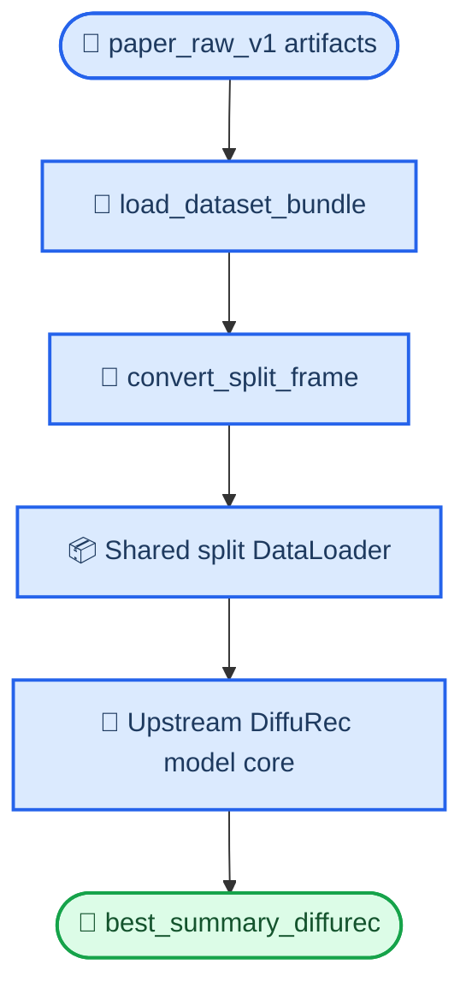

# CLOSE-04 协议一致性审计

_日期：2026-07-09_
_用途：审计 `DiffuRec` 本地 wrapper 当前是否已经满足 `CLOSE-04` 的协议一致性要求，即直接消费共享 regenerated protocol，而不是走 upstream 原生预处理路线_

---

## 📝 一句话结论

截至 2026-07-09，本地 `DiffuRec` wrapper 已经满足 `CLOSE-04` 的关键协议约束：它直接读取 `dataset/paper_raw_v1/<dataset>/protocol.json` 与 `train_data.df / val_data.df / test_data.df`，在本地代码路径上**没有**回退到 upstream 原生 `dataset.pkl` 预处理的分支。当前缺失的不是协议对齐，而是远端四数据集正式跑完后的 dated 结果表。

## 📍 审计对象

- 运行脚本：`scripts/run_close04_diffurec.py`
- 结果表脚本：`scripts/build_close04_external_baseline_table.py`
- 相关测试：
  - `tests/test_run_close04_diffurec.py`
  - `tests/test_build_close04_external_baseline_table.py`
- 选择说明：`docs/reports/data/2026-07-07-close04-diffurec-choice-note.md`

## 🔍 关键问题

`CLOSE-04` 的 review-initial 要求是：

> baseline 必须消费 regenerated splits，而不是使用它自己的原生预处理路径。

所以本审计只回答三件事：

1. wrapper 输入是不是 `paper_raw_v1`
2. wrapper 是否读取共享 split / selector 结构
3. table builder 是否能把 baseline / host / ours 放到同一协议下比较

## 📦 Wrapper 输入审计

### 1. 默认数据根目录

`scripts/run_close04_diffurec.py` 定义：

- `DEFAULT_DATASET_ROOT = REPO_ROOT / "dataset" / "paper_raw_v1"`

这说明默认数据入口就是 regenerated protocol，而不是 upstream 自己的 `datasets/data/<dataset>/dataset.pkl`。

### 2. 读取逻辑

脚本中的 `load_dataset_bundle(dataset_dir)` 会：

- 先读取 `protocol.json`
- 再读取：
  - `train_data.df`
  - `val_data.df`
  - `test_data.df`

而不是去找 upstream 的 `dataset.pkl`。

### 3. 行级转换

`convert_split_frame(...)` 把 row-level `seq/next` 样本转成 DiffuRec 可吃的 one-based 序列与标签，说明：

- wrapper 是在**适配共享协议**
- 不是要求共享协议先伪装成 upstream 自有数据格式再跑

## 🔁 与 upstream 路径的关系

`docs/reports/data/2026-07-07-close04-diffurec-choice-note.md` 已明确说明：

- upstream `DiffuRec` 期望的是 `dataset.pkl`
- 我们的 regenerated protocol 输出的是 `paper_raw_v1/<dataset>/train_data.df` 等
- 因此不能声称“直接把 `paper_raw_v1` 丢给 upstream 就完成了协议对齐”

现在本地 wrapper 的作用正是解决这层不兼容：

## ✅ 本地测试支持

### `tests/test_run_close04_diffurec.py`

这组测试已经覆盖了本地协议桥的关键点：

- `convert_split_frame` 是否正确处理 zero-pad 与 one-based item id
- `build_summary_payload` 是否按 shared selector 语义写出 summary
- `load_dataset_bundle` 是否读取 `protocol.json` 与 `train/val/test_data.df`

### `tests/test_build_close04_external_baseline_table.py`

这组测试覆盖了：

- baseline / host / ours 三方 summary 是否能被放到同一比较表里
- `delta_baseline_vs_host_ndcg10`
- `delta_baseline_vs_ours_ndcg10`

它证明 table builder 的输入合同已经建立，不必等远端完整跑完才知道脚本结构是否正确。

## ⚠ 仍未完成的部分

本审计**不**证明下面这些事已经完成：

1. DiffuRec 远端四数据集正式结果已经全部落地
2. baseline 结果表已经可以回填主稿
3. `CLOSE-04` 的 review-regression 可以完成

当前仍缺：

- 远端正式 run 的 dated 结果表
- 本地同步回来的 baseline 对照 artifact

## 🔆 对 `CLOSE-04` 的直接意义

这份审计支持下面这句更精确的状态判断：

> `CLOSE-04` 的本地集成与协议一致性已经成立，当前剩余风险主要在远端运行结果，而不在“baseline 是否走偏了协议”。

所以在账本上，`review_initial_state` 可以和“协议一致性已审过”绑定，而不需要等四数据集结果全部跑完。
