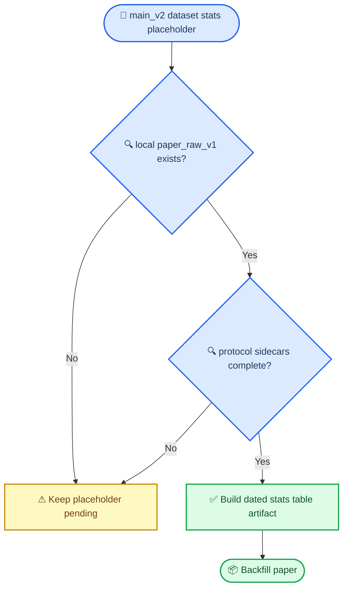

# 数据集统计来源审计

_日期：2026-07-09_
_用途：审计 `paper/main_v2.tex` 中“数据集统计表”占位当前能否由本地工作区直接回填_

---

## 📝 一句话结论

截至 2026-07-09，本地工作区仍然**没有** `dataset/paper_raw_v1/*/protocol.json` 这类直接 sidecar，但已经拥有一份 dated 派生统计表：

- `docs/reports/data/2026-07-09-paper-dataset-stats-table.csv`
- `docs/reports/data/2026-07-09-paper-dataset-stats-table.md`

它们来自已本地落地的 `docs/reports/data/2026-07-02-gate0/gate0_failure_component_summary.csv`，足以支撑 `paper/main_v2.tex` 中 setup 位置的数据集统计表回填。换句话说，当前缺失的是完整 sidecar 集，不是 paper-level dataset stats 数字本身。

## 📍 审计对象

- 论文主稿：`paper/main_v2.tex`
- 相关占位：setup 段数据集统计表
- raw-data protocol 规范：`docs/reports/2026-06-24-raw-data-protocol-recommendation.md`
- 本地数据目录：`dataset/`

## 🔍 本地目录现状

当前本地 `dataset/` 下存在：

- `ASO/`
- `ATG/`
- `Beauty/`
- `ML1M/`
- `steam/`
- `raw/`

当前本地**不存在**：

- `dataset/paper_raw_v1/`
- 任何本地 `protocol.json`
- 任何本地 `item_mapping.csv`

## 📊 本地可见的 legacy 统计

以下信息都来自 legacy sidecar，而不是 regenerated raw-data protocol：

| dataset | `seq_size` | `item_num` | train rows | val rows | test rows |
| --- | ---: | ---: | ---: | ---: | ---: |
| steam | 10 | 9265 | 988188 | 81691 | 80572 |
| ML1M | 10 | 3883 | 755782 | 98622 | 393351 |
| Beauty | 10 | 12101 | 17890 | 2236 | 2237 |
| ATG | 10 | 11924 | 15529 | 1941 | 1942 |
| ASO | 10 | 18357 | 28478 | 3559 | 3561 |

这些数字来自：

- `dataset/*/data_statis.df`
- `dataset/*/{train_data.df,val_data.df,test_data.df}`

## ⚠ 为什么这些数字不能直接回填论文主表

`docs/reports/2026-06-24-raw-data-protocol-recommendation.md` 已经把底线说得很清楚：

1. 不要把 legacy checked-in `df` 文件和 regenerated raw-data splits 混在同一张主表里。
2. 如果论文主张 raw-data reproducibility，就必须以明确的 raw-data protocol 工件作为主来源。
3. 未来 paper protocol 应依赖：
   - regenerated split files
   - `item_mapping.csv`
   - `protocol.json`
   - 显式 raw source / filtering / dedupe / split 规则

而当前本地工作区缺的恰恰就是这一套 `paper_raw_v1` 权威 sidecar。

## 🔁 与占位符的关系

## ✅ 当前最诚实的处理方式

对 `paper/main_v2.tex`：

- 不应再用 legacy `data_statis.df` 直接回填
- 应改用 `2026-07-09-paper-dataset-stats-table.*` 作为本地 dated 纸面统计来源

对 closeout 账本：

- 可以把这份审计说明与新的 paper-level 统计表一起挂到 `CLOSE-07`
- 把 “为什么此前没法诚实回填” 和 “现在为什么可以回填” 都留成 dated 文档链

对内部协作：

- legacy 数字依然只适合内部兼容参考
- 纸面统计表现在可以从 Gate0 组件汇总 artifact 派生回填
- 但任何更强的“完整 reproducibility bundle 已包含全部 `paper_raw_v1` sidecar” 说法仍然不成立

## 🔆 结论

这件事现在已经从“当前不能回填”推进到了“可以按派生 artifact 回填 paper-level 统计，但仍不能声称 sidecar 全量在手”。因此，setup 里的数据集统计占位现在可以被诚实吃掉，而更高层级的 reproducibility / supplement 叙事仍需等待完整 `paper_raw_v1` sidecar。
