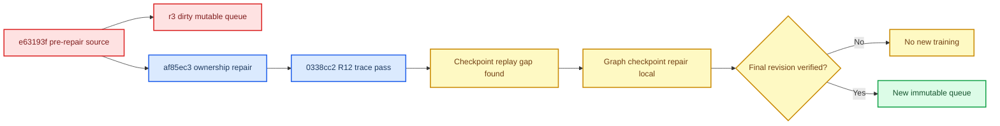

# E1/R12 Ownership and Checkpoint Scope Amendment

_PreferGrow AAAI-27 · 2026-07-11 · implementation evidence amendment_

## 📋 Decision

R12 remains a **revision-scoped E1 pass** for its designated Beauty trace at source revision `0338cc2…`; it is not invalidated by the later audit of r3. The apparent contradiction came from comparing different source revisions:

- r3 declared and executed `e63193f…`, before the graph-`p1` ownership repair;
- the ownership repair entered at `af85ec3…`;
- R12 used descendant `0338cc2…` and explicitly exercised the repaired production parameter order.

R12 does not cover standalone checkpoint serialization. That separate omission was discovered during this amendment: graph-owned host `p1` was present in optimizer/EMA memory but absent from explicit graph checkpoint state, while the common frozen evaluator constructed EMA from model parameters only. A local repair now extends the contract through graph state and common-evaluator restoration, but it remains pending final verification and commit.

## 🧭 Revision Chain

## 🔍 Object-Ownership Trace

| Path | Pre-repair `e63193f` r3 source | Repaired `af85ec3+` source | R12 `0338cc2` |
|---|---|---|---|
| Host proposal owner | `graph.p1` | `graph.p1` | `graph.p1` |
| Full/global-p proposal owner | `model.text_side_builder.p1` | `model.text_side_builder.p1` | `model.text_side_builder.p1` |
| Host `p1` in optimizer | No | Yes, exactly once | Yes, traced |
| Host `p1` in EMA/update/eval parameter list | No | Yes | Yes, traced |
| Graph state explicit in best/latest checkpoint | No | No before this amendment | Not tested by R12 |
| Common frozen evaluator applies host graph `p1` EMA | No | No before this amendment | Not tested by R12 |

The R12 harness was not an arbitrary optimizer exception. At `0338cc2`, it mirrored the repaired `single_train.py` contract introduced by `af85ec3`: model parameters plus graph-owned `p1` for host, and model-owned builder `p1` for full/global-p. The r3 runtime source did not contain that repair.

## 📊 R12 Evidence Retained

| Field | Frozen value |
|---|---|
| Dataset | Beauty only |
| Seed | 100 |
| Arms | AdaptiveWise host, final-v2 closed-gate full, global-p |
| Steps | 0, 1, 100, 1000 |
| FP32 tolerance | `1e-6` |
| Comparisons by step | 592 / 802 / 802 / 790 |
| Total | 2,986 comparisons |
| Failures | 0 |
| First divergence | `null` |
| Trace report SHA-256 | `b912d5b6807320e9466048bc6e98ec470e85e510433b3471c65c94a569e387ce` |
| `E01_PASS.json` file SHA-256 | `1da54cf25f936a7b09397cf78f14162f3ab02e0caa1c46dfa2d3aba4b37c017f` |
| `RISK-02_PASS.json` file SHA-256 | `040afa9328e05ba6fcfb36b26ae561657236a0d0a033e97e9ceb7c9a40a2924c` |

The three hashes refer to different byte artifacts and must not be interchanged. The R12 report explicitly limits itself to Beauty because that trace constructed a matched AdaptiveWise host/full/global-p trio; it does not claim ML1M equivalence.

## ✅ Supported Wording

The following statement is supported:

> At source revision `0338cc2`, a seed-100 Beauty trace compared the repaired AdaptiveWise host, final-v2 closed-gate full path, and global-p path at steps 0, 1, 100, and 1000. All 2,986 preregistered numerical comparisons passed with zero failures under the frozen FP32 tolerance. This is implementation evidence for the designated in-memory training and kernel path, not a recommendation-performance equivalence result.

## 🚫 Unsupported Wording

Do not state any of the following:

- “r3 used the R12-passed production host.”
- “R12 proves every later commit preserves parity.”
- “R12 proves best/latest host checkpoints reproduce graph `p1`.”
- “R12 proves equal NDCG or end-to-end statistical equivalence.”
- “The two r3 host summaries are matched fallback-core results.”

## 🧪 Checkpoint Contract Added After R12

The local repair introduces three auditable elements:

1. production constructs one named training-parameter order shared by optimizer-adjacent EMA and evaluation;
2. best/latest checkpoints explicitly store graph state and that parameter order;
3. the common frozen evaluator reconstructs model-plus-graph parameters, validates EMA count and shape, and applies the graph-owned `p1` EMA before sampling.

Legacy host checkpoints without explicit graph state can be evaluated only when their EMA contains an unambiguous extra graph-`p1` slot in the production order. A legacy checkpoint whose EMA contains model parameters only now fails closed rather than silently evaluating a uniform host proposal.

## 🛑 Prelaunch Gate

A new queue may not inherit R12 by narrative alone. Before launch, all of the following are required:

- commit the queue-safe and checkpoint-contract repair;
- run fresh checkpoint round-trip, common-evaluator, E1 trace, and queue regression suites;
- deploy the exact committed tree to an immutable source root;
- run a final-revision ownership/closed-gate trace or explicitly scoped equivalent smoke;
- bind the exact source revision and source manifest into the amended RISK-05 implementation artifact and every task;
- verify r3 remains stopped and no r3 artifact is mixed into the new RISK-08 chain.

Machine-readable scope is frozen in [e01_r12_ownership_scope_amendment.json](e01_r12_ownership_scope_amendment.json). Original R12 evidence remains in [the R12 attempt manifest](../2026-07-11-e01-gzero-production-trace-r12/attempt_manifest.md), and the r3 disposition is recorded in [the r3 fail-closed audit](../2026-07-11-risk0607-r3-fail-closed-audit/risk0607_r3_fail_closed_audit.md).
