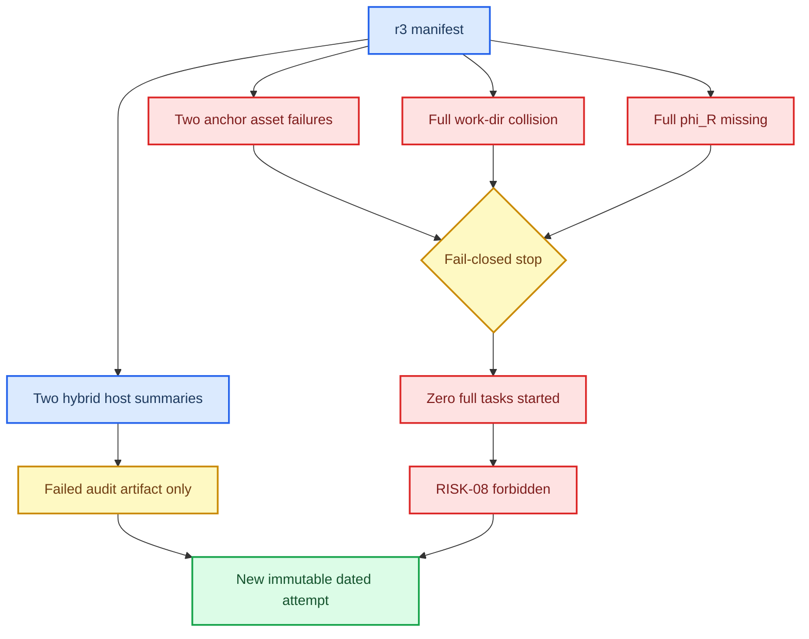

# RISK-06/RISK-07 r3 Fail-Closed Audit

_PreferGrow AAAI-27 · checked at 2026-07-11 17:18:42 +08:00 · read-only server audit_

## 📋 Executive Decision

The r3 queue is a **failed audit artifact only**. It must not be resumed, reused, merged into a later manifest, or promoted to RISK-08. At the audit time, `STOP_AFTER_CURRENT` remained present, the controller had no running task, and the terminal accounting was 2 passed / 2 failed / 18 pending. No `risk_gated_full` task started.

The two completed host summaries are preserved but are ineligible as repaired-host evidence: both used `graph.type=hybrid` from mutable dirty source revision `e63193f…`, which predates the production graph-`p1` ownership repair in `af85ec3`. They may only be cited as provenance-limited single-run validation observations from the failed r3 attempt.

## 🚦 Queue State

| Field | Read-only observation |
|---|---|
| Queue root | `/data/Zijian/goal/aaai27_queue/2026-07-11-risk0607-332efb8-r3` |
| Manifest SHA-256 | `559808f19da0bc066d9a658bd022757b9573a00ea38583736e4c76d247891653` |
| Manifest task revision | `e63193f9485b554c52fd91a676102546c0687fc1` |
| Runtime source root | `/data/Zijian/goal/RecDemo` (dirty, mutable) |
| Stop marker | `state/STOP_AFTER_CURRENT` |
| Stop marker SHA-256 | `048436a4ae6128513025342498fef51092e32c1a3c264ab0744350528bc07715` |
| Controller | PID `2798369`; liveness true; no running child |
| Task counts | 2 passed / 2 failed / 18 pending / 0 ready / 0 running |
| GPU state | GPU0 retained external CLOSE-10 PID `2568867`; GPU1 had no training process |
| Disk | Approximately 47 GiB free on `/data`, above the 40 GiB dispatch floor |



## 📊 Terminal Task Evidence

| Task | Terminal state | Evidence | Allowed interpretation |
|---|---|---|---|
| `pilot.e1_pass.Beauty.host` | passed | Best validation NDCG@10 `0.02209269400633314` at step `8000`; summary SHA `1b5b056b…` | Ineligible hybrid-host single-run validation observation from r3 |
| `pilot.e1_pass.Steam.host` | passed | Best validation NDCG@10 `0.01531301051497468` at step `28000`; summary SHA `d5476807…` | Ineligible hybrid-host single-run validation observation from r3 |
| `pilot.e1_pass.Beauty.anchor.c0` | failed | `FileNotFoundError`; log SHA `10cd98e0…` | Pre-training asset-path failure; no performance result |
| `pilot.e1_pass.Beauty.anchor.c100` | failed | `FileNotFoundError`; log SHA `22a8dec6…` | Pre-training asset-path failure; no performance result |

Test metrics were present in the host summaries because the development code logs test metrics. They were not used for model selection in this audit; the table reports validation-selected values only. This does not make test an untouched final holdout.

## 🔍 Root-Cause Findings

### Asset binding

The failing anchor commands addressed guessed locations:

```text
/data/Zijian/goal/RecDemo/banks/Beauty/0/embeddings.pt
/data/Zijian/goal/RecDemo/banks/Beauty/100/embeddings.pt
```

The frozen RISK-04 assets instead use exact level-labelled paths beneath:

```text
/data/Zijian/goal/RecDemoRuns/aaai27_risk04_assets_2026-07-11_332efb8_gatepass_final/
  banks/Beauty/level-000/embeddings.pt
  banks/Beauty/level-060/embeddings.pt
  banks/Beauty/level-100/embeddings.pt
```

The manifest generator therefore failed to consume the path and embedding SHA recorded by RISK-04.

### Full/anchor work-directory collision

For `pilot.e1_pass.Beauty.full.c0`, the task record and Hydra argv disagreed:

```text
task.run_dir = .../Beauty/full_c0
argv work_dir = .../Beauty/anchor_c0
```

The same copy pattern affected all six full tasks. None started before the stop marker was installed, so no full task wrote into an anchor directory.

### Missing preregistered dataset gate

No full argv contained `text_side.gate_dataset_scale_override=<phi_R>` or `text_side.text_utility_report_path=...`. Under the then-deployed code, the dataset gate would silently default to `1.0`. Therefore even a path-corrected r3 full task would not instantiate the RISK-05 `phi_R` controlled-risk method.

### Source-revision mismatch

Each r3 task declared revision `e63193f…` and ran from dirty `/data/Zijian/goal/RecDemo`. The graph-`p1` ownership repair entered the branch at `af85ec3`; R12 used descendant `0338cc2`. This resolves the apparent static-audit contradiction: the defect is real for r3's source, while R12's optimizer/EMA trace remains revision-scoped evidence for its own repaired source. R12 identity cannot be transferred to r3.

## 🧾 Evidence Classification

| Claim | r3 support |
|---|---|
| Queue/controller safety stop worked without killing GPU0 work | Supported by controller status and retained stop marker |
| Asset paths and hashes satisfied RISK-04 | Not supported |
| Full arm used preregistered `phi_R` | Not supported |
| Repaired host/core ownership was used | Not supported |
| Controlled corruption efficacy | Not supported |
| Complete RISK-06/RISK-07 pilot | Not supported |
| RISK-08 exit | Forbidden |

## 🛑 Immutable Disposition

- Keep `STOP_AFTER_CURRENT`; do not delete it.
- Do not restart r3 or launch a second controller against r3.
- Do not combine the two r3 host summaries with tasks from another manifest.
- Do not call either failed anchor a negative recommendation result; training did not start.
- Create a new queue root and immutable source bundle after local regression, checkpoint-contract, and protocol-amendment gates pass.

## 🧰 Audited Read-Only Commands

```bash
/data/Zijian/goal/PreferGrow/.venv/bin/python3 \
  /data/Zijian/goal/aaai27_method_pass_bundle_20260711_c7be478/scripts/aaai27_resident_queue.py \
  status \
  --queue-root /data/Zijian/goal/aaai27_queue/2026-07-11-risk0607-332efb8-r3 \
  --json

nvidia-smi --query-compute-apps=gpu_uuid,pid,process_name,used_memory \
  --format=csv,noheader

df -BG --output=source,size,used,avail,pcent,target /data

git -C /data/Zijian/goal/RecDemo rev-parse HEAD
git -C /data/Zijian/goal/RecDemo status --short
```

Machine-readable facts are frozen in [risk0607_r3_fail_closed_audit.json](risk0607_r3_fail_closed_audit.json). The R12 trace remains separately archived in [the R12 artifact directory](../2026-07-11-e01-gzero-production-trace-r12/attempt_manifest.md).
