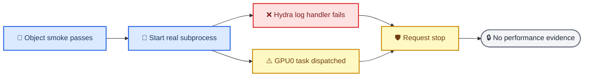

# RISK-06/RISK-07 r5 live-startup fail-closed audit

_PreferGrow AAAI-27 · 2026-07-11 · read-only reconstruction of r5; no performance evidence_

---

## 📋 Verdict

r5 is closed as `failed_before_training`. Its object-level prelaunch smoke passed within its declared scope, but the real Hydra subprocess path failed before the training loop. Seven tasks exited with code `1`, fifteen tasks were never launched, and the queue produced zero `step:` lines, checkpoints, best summaries, or run directories. `STOP_AFTER_CURRENT` is present, no task is running, and r5 is permanently ineligible for retry, reuse, or RISK-08.

The queue also dispatched `pilot.e1_pass.Beauty.full.c0` to GPU0 even though the dated resource authorization allowed only GPU1. That task hit the same Hydra logging failure before entering training. The dispatch proves a launch-contract defect; it does not produce a model result.



## 🔍 Direct evidence

| Evidence | Observed value |
| --- | --- |
| Queue root | `/data/Zijian/goal/aaai27_queue/2026-07-11-risk0607-6f18b3d-r5` |
| Manifest SHA-256 | `5a7d1c253c88f4689f96e1c9f57b5edac9f429818284e879b702ddb20358f2ed` |
| Protocol SHA-256 | `3bf4cba9a71bf0232dc9e4d46e451879104428d6037bf5610a2f17faf561afeb` |
| Controller | PID `2872090`, alive only to honor the stop marker |
| Queue state | `failed=7`, `pending=15`, `running=0`, `ready=0`, `passed=0` |
| Stop marker SHA-256 | `048436a4ae6128513025342498fef51092e32c1a3c264ab0744350528bc07715` |
| Common task-log SHA-256 | `f9688662cd3f728bb39433e899b35f94c8bedcdc23fd8e4aa7e6540c26e2c57a` |
| Events SHA-256 | `6de21003721aecf9b16bea25112862196013e9fc9ac1b46d7d1c68cb92a06796` |
| Controller-accounted GPU time | `0.01951512573445345` GPU-h spent in failed startup processes |
| Scientific output | None |

Every task log contains the same decisive line:

```text
PermissionError: [Errno 13] Permission denied: '/data/Zijian/goal/RecDemo_aaai27_risk0607_6f18b3d/single_train.log'
ValueError: Unable to configure handler 'file'
```

The immutable source root is `dr-xr-xr-x`; every manifest task sets `cwd` to that root while its intended `run_dir` is under the queue. `ProcessSupervisor` forwards `task.cwd` to `subprocess.Popen`. Hydra initializes its relative file handler before `single_train.main` can redirect model outputs to `work_dir`, so the failure occurs before training.

## ⚠️ GPU contract finding

The prelaunch resource audit at `2026-07-11T19:51:21+08:00` recorded external GPU0 PID `2568867` using `8070` MiB and authorized GPU1 only. The manifest nevertheless encoded `gpu_ids=[0,1]`; the controller mechanically forwarded that pair to the runtime. At `2026-07-11T11:58:07.664630+00:00`, record SHA-256 `4ba9ab0be5e0526d77398d0c47e17b027e0d8960fcd6e7b1c9cd0663662f08da` assigned `pilot.e1_pass.Beauty.full.c0` to GPU0.

This audit does not infer why the occupancy probe returned no blocking PID at that exact dispatch. The historical raw probe output was not persisted, and by the read-only snapshot at `2026-07-11T20:08:11+08:00` PID `2568867` had exited naturally and both GPUs were idle. That narrower probe question remains pending dynamic and implementation audit. The independently proven defect is that a GPU1-only authorization was not encoded as an allowlist.

## 🧪 Evidence grading

| Claim | Grade | Allowed interpretation |
| --- | --- | --- |
| Object construction and temporary checkpoint replay | Contract-only | The scoped prelaunch smoke passed |
| Real Hydra startup | Direct failure evidence | The live subprocess contract failed |
| Host/full model quality | No evidence | No metric or training claim is allowed |
| GPU0 dispatch | Direct task-record evidence | The runtime violated the GPU1-only launch contract |
| Occupancy-probe failure mechanism | Pending confirmation | Do not choose between probe defect and process-exit timing yet |

## 🔒 Disposition

- Preserve r3, r4, and r5 without deletion, overwrite, restart, or retry
- Leave the r5 controller alive with `STOP_AFTER_CURRENT`; do not kill it
- Do not generate or interpret RISK-08 from r5
- Require a new commit, archive, immutable source, protocol, manifest, and queue root for r6
- Require `cwd==run_dir`, absolute source entry paths, manifest `gpu_ids=[1]`, fail-closed occupancy parsing, corrected launcher arguments, and a real Hydra startup probe before any r6 controller starts

## 🔧 Audit commands

```bash
/data/Zijian/goal/PreferGrow/.venv/bin/python3 \
  /data/Zijian/goal/RecDemo_aaai27_risk0607_6f18b3d/scripts/aaai27_resident_queue.py \
  status --queue-root /data/Zijian/goal/aaai27_queue/2026-07-11-risk0607-6f18b3d-r5 --json

sha256sum /data/Zijian/goal/aaai27_queue/2026-07-11-risk0607-6f18b3d-r5/state/tasks/*.json
sha256sum /data/Zijian/goal/aaai27_queue/2026-07-11-risk0607-6f18b3d-r5/logs/tasks/*.log
grep -n PermissionError /data/Zijian/goal/aaai27_queue/2026-07-11-risk0607-6f18b3d-r5/logs/tasks/*.log
nvidia-smi --query-gpu=index,uuid,name,memory.total,memory.used,memory.free,utilization.gpu --format=csv,noheader,nounits
nvidia-smi --query-compute-apps=gpu_uuid,pid,process_name,used_memory --format=csv,noheader,nounits
```
