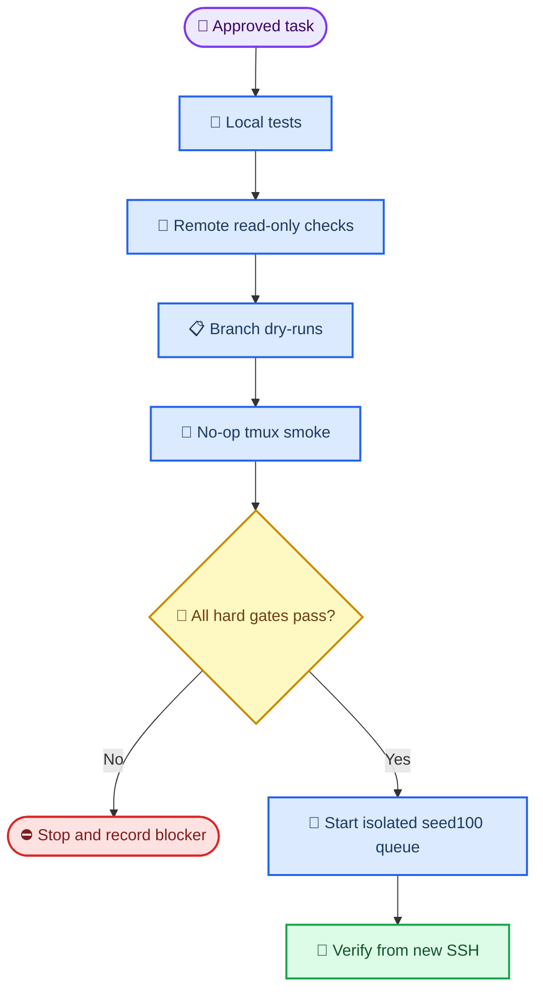

# AAAI-27 seed=100 resident queue runbook

_Operator runbook for the fail-closed controller and the isolated l20 deployment path, frozen 2026-07-10._

---

## 🔐 Authorization gate

This runbook separates local verification, remote no-op validation, and real experiment launch. The current user authorization covers implementation, server verification, and a real seed-100 launch, but authorization is consumed only after every DEPLOY-01 hard gate passes. A local unit test, a printed SSH command, or a no-op smoke is not evidence that a scientific run started.

The queue is subordinate to the approved [resident queue design](../superpowers/specs/2026-07-10-aaai27-seed100-resident-queue-design.md), its implementation [plan](../superpowers/plans/2026-07-10-aaai27-seed100-resident-queue.md), and the execution [CSV](../../issues/2026-07-10_22-34-15-aaai27-seed100-resident-queue-execution.csv). The CSV is the only execution state source.



Hard constraints are immutable for this queue:

- New training and corruption tasks use only `seed=100`
- Each L20 has at most one training process
- Each task has `max_attempts=1` and `failure_policy=fail_closed`
- The cumulative forecast ceiling is exactly `168 GPU-hours`
- Each wave requires at least `40 GiB` free under `/data`
- Seeds `101/102`, BERT4Rec, DiffuRec confirmation runs, rescue tuning, threshold changes, corruption-level changes, and automatic retries are disabled
- Every run uses a new isolated directory and cannot overwrite frozen or stale artifacts

## 📋 Prerequisites

Run the following variable block in a Bash shell on the operator workstation. Replace no operands after the block; all commands below use these resolved variables.

```bash
QUEUE_ROOT=/data/Zijian/goal/RecDemoRuns/aaai27_seed100_resident_20260710-220000
MANIFEST="$QUEUE_ROOT/queue/queue_seed100.json"
BUNDLE=/data/Zijian/goal/aaai27_seed100_bundle_20260710
REMOTE_PYTHON=/data/Zijian/goal/PreferGrow/.venv/bin/python
SESSION=aaai27_seed100_queue
REMOTE_ENTRY="$BUNDLE/scripts/aaai27_remote_tmux_entry.py"
CONTROLLER_ENTRY="$BUNDLE/scripts/aaai27_resident_queue.py"
HOST=zijian@172.18.0.40
```

The expected l20 identity is `ubuntu` with two NVIDIA L20 cards. This is an observation to recheck, not a permanent assumption. The previous remote checkout under `/data/Zijian/goal/PreferGrow` is not overwritten by this workflow.

Before remote mutation, confirm locally:

```bash
git status --short
git rev-parse HEAD
python -m unittest \
  tests.test_aaai27_queue_models \
  tests.test_aaai27_queue_validation \
  tests.test_aaai27_queue_storage \
  tests.test_aaai27_queue_scheduler \
  tests.test_aaai27_queue_runtime \
  tests.test_aaai27_queue_controller \
  tests.test_aaai27_queue_cli \
  tests.test_launch_aaai27_seed100_queue -v
```

The focused suite must report zero failures and zero errors. A platform-expected Windows skip for Linux `flock` is not a remote verification substitute.

## 🔎 Read-only validation

These commands inspect the bundle and queue without creating a queue root, marker, tmux session, process, checkpoint, or run directory.

```bash
"$REMOTE_PYTHON" "$CONTROLLER_ENTRY" validate \
  --queue-root "$QUEUE_ROOT" \
  --manifest "$MANIFEST" \
  --json
```

The result must report `status=valid`, `gpu_ids=[0,1]`, a seed set containing only `100`, an exact `168.0` GPU-hour budget, and `40.0` GiB minimum free space. It must not report DiffuRec, BERT4Rec, seeds 101/102, or partial classic baseline groups.

Recheck the server identity, disk, GPU, tmux, and compute PIDs through a fresh SSH connection:

```bash
ssh -n -T -o BatchMode=yes "$HOST" \
  "hostname; date '+%F %T %z'; df -BG /data; nvidia-smi --query-gpu=index,name,memory.total,memory.used,utilization.gpu --format=csv,noheader; nvidia-smi --query-compute-apps=gpu_uuid,pid,process_name --format=csv,noheader; tmux list-sessions 2>/dev/null || true"
```

The output must show hostname `ubuntu`, at least `40G` free under `/data`, exactly two L20 devices, no unknown compute PID, and no conflicting queue session. `tmux list-sessions` returning no server is acceptable before deployment.

## 🧪 Branch dry runs

Dry-run is read-only. It loads and validates the manifest, computes the frozen branch selection, and never invokes task argv.

E1 pending after a terminal pass must select the complete 14-task E1-pass pilot:

```bash
"$REMOTE_PYTHON" "$CONTROLLER_ENTRY" dry-run \
  --queue-root "$QUEUE_ROOT" \
  --manifest "$MANIFEST" \
  --e1-outcome pass \
  --risk08-exit pending
```

E1 terminal failure before RISK-08 must select exactly the eight audit-only tasks (Beauty/Steam host plus three `text_anchor_only` conditions each), with zero `risk_gated_full` tasks:

```bash
"$REMOTE_PYTHON" "$CONTROLLER_ENTRY" dry-run \
  --queue-root "$QUEUE_ROOT" \
  --manifest "$MANIFEST" \
  --e1-outcome fail \
  --risk08-exit pending
```

Once `audit_only` or `submission_stop` is recorded, the branch is terminal and must select zero continuation tasks:

```bash
"$REMOTE_PYTHON" "$CONTROLLER_ENTRY" dry-run \
  --queue-root "$QUEUE_ROOT" \
  --manifest "$MANIFEST" \
  --e1-outcome fail \
  --risk08-exit audit_only

"$REMOTE_PYTHON" "$CONTROLLER_ENTRY" dry-run \
  --queue-root "$QUEUE_ROOT" \
  --manifest "$MANIFEST" \
  --e1-outcome fail \
  --risk08-exit submission_stop
```

`risk_gated_method` is valid only with E1 pass. Any E1-fail plus `risk_gated_method` combination is an integrity error and must stop before task selection.

## 🖨️ Print-only launch

The local launcher constructs a shell-free SSH argv. `--print-only` must not invoke SSH, upload files, create a directory, inspect tmux, or mutate l20.

```bash
python scripts/launch_aaai27_seed100_queue.py \
  --host "$HOST" \
  --remote-python "$REMOTE_PYTHON" \
  --remote-entry "$REMOTE_ENTRY" \
  --queue-root "$QUEUE_ROOT" \
  --manifest "$MANIFEST" \
  --session "$SESSION" \
  --connect-timeout 10 \
  --print-only
```

Review the printed argv and confirm:

- It begins with `ssh -n -T -o BatchMode=yes`
- The remote command is one SSH argument
- The command contains the new queue root, manifest, session, and remote entry
- No upload, delete, overwrite, `--force`, or `tmux kill-session` operation appears

## 🚀 Authorized start

Only run this section after the full DEPLOY-01 report is complete and recorded in the execution CSV. DEPLOY-01 must include matching local/remote bundle hashes, remote Python/dependency checks, Linux `flock`, `nvidia-smi`, disk/GPU checks, both branch dry-runs, and a no-op tmux smoke with no scientific PID, checkpoint, or `runs/` directory.

The launcher asks the remote entry to verify hostname `ubuntu`, validate session metadata, preserve a live matching session, reject a mismatched session, and create a new session only when no live session exists. It never replaces a live session.

```bash
python scripts/launch_aaai27_seed100_queue.py \
  --host "$HOST" \
  --remote-python "$REMOTE_PYTHON" \
  --remote-entry "$REMOTE_ENTRY" \
  --queue-root "$QUEUE_ROOT" \
  --manifest "$MANIFEST" \
  --session "$SESSION" \
  --connect-timeout 10
```

Immediately record the returned result and inspect the session from a second SSH connection. A successful launch is not established by the local command returning zero alone.

## 📊 Read-only status

Use a fresh SSH connection for status. This command does not start, stop, or restart a task.

```bash
ssh -n -T -o BatchMode=yes "$HOST" \
  "$REMOTE_PYTHON $CONTROLLER_ENTRY status --queue-root $QUEUE_ROOT --json"
```

For a running queue, retain the JSON output together with:

- queue root and manifest SHA-256
- controller PID and process-start token
- each task record status, PID, GPU, attempt, start time, end time, exit code, and GPU seconds
- gate markers and RISK-08 outcome
- cumulative GPU-hour usage and free `/data` space
- `logs/events.jsonl` and task log paths

The status output is not a substitute for the original task artifacts or evaluator logs.

## ⏹️ Safe stop

`request-stop` creates `state/STOP_AFTER_CURRENT`. It prevents new dispatches and permits currently running tasks to finish. It never sends a kill signal and never authorizes an automatic retry.

```bash
ssh -n -T -o BatchMode=yes "$HOST" \
  "$REMOTE_PYTHON $CONTROLLER_ENTRY request-stop --queue-root $QUEUE_ROOT"
```

Verify that the marker exists and that running task records remain unchanged. Do not remove or overwrite the marker to resume work; resumption requires an explicit later authorization and a fresh status/audit decision.

## 🔄 Recovery

If the tmux session disappears, reconnect to the same queue root. Recovery is controller recovery, not permission to repeat a scientific attempt.

```bash
ssh -n -T -o BatchMode=yes "$HOST" \
  "$REMOTE_PYTHON $CONTROLLER_ENTRY status --queue-root $QUEUE_ROOT --json"
```

A persisted running record is considered live only when its PID and Linux process-start token match. An absent or mismatched process becomes `interrupted_unverified`; `unverified:<pid>` identities fail closed after controller recovery. Because `max_attempts=1`, the controller never recreates that task automatically.

If the queue is nonterminal and a later authorized recovery is required, use the same root, manifest, bundle, and session metadata. Do not create a second root for the same attempt and do not alter task arguments. A terminal queue is never restarted by the remote entry.

## 📦 Evidence handoff

The final handoff must include both orchestration evidence and scientific evidence. At minimum, archive:

| Evidence | Required content |
| --- | --- |
| Bundle identity | Local and remote `SHA256SUMS`, code revision, manifest hash |
| Gate state | E1 marker, RISK-08 exit, marker hashes and validation records |
| Process state | Hostname, tmux session, controller PID/start token, task PIDs and GPUs |
| Resource state | L20 model/VRAM, compute PID listing, `/data` free GiB, GPU-hour total |
| Runtime logs | `events.jsonl`, controller log, per-task logs, exit codes |
| Task artifacts | Every declared success artifact and its hash; no missing or stale artifact reuse |
| Reconnect proof | Fresh SSH status showing the same session/controller/task state |
| Scientific interpretation | Single-run observations only; no unsupported significance or stability claims |

Only after this handoff contains a live tmux session, controller PID, manifest hash, first real training PID/GPU, run directory, task log, and fresh-SSH reconnect proof may the operator close the local computer.
