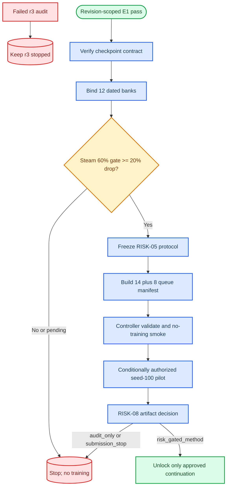

# E1/R12 版本绑定后的 RISK-04～08 seed-100 实验手册

_PreferGrow AAAI-27；日期：2026-07-11（Asia/Shanghai）；本手册定义修复后新 dated attempt 的可审计资产、checkpoint 与队列边界。_

---

## 🧭 当前状态与授权边界

E1 在 R12 dated attempt 的指定 revision `0338cc2…` 上通过：`random_seed=100`，trace steps 为 `0,1,100,1000`，FP32 tolerance 为 `1e-6`，`comparisons=2986`，`failed_comparisons=0`，`first_divergence=null`。证据位于 [R12 trace report](../reports/data/2026-07-11-e01-gzero-production-trace-r12/e01_gzero_trace.json)、[RISK-02 pass marker](../reports/data/2026-07-11-e01-gzero-production-trace-r12/RISK-02_PASS.json) 和 [R12 attempt manifest](../reports/data/2026-07-11-e01-gzero-production-trace-r12/attempt_manifest.md)。R12 只证明该 revision、Beauty、指定三臂在内存训练路径上的 trace contract；不证明任意后续 revision、standalone checkpoint replay、推荐指标等价或 RISK-08。

r3 队列已 fail closed，详见 [r3 audit](../reports/data/2026-07-11-risk0607-r3-fail-closed-audit/risk0607_r3_fail_closed_audit.md)。r3 从 pre-repair `e63193f…` dirty source 运行，出现错误 bank path、full/anchor `work_dir` 碰撞及 full 缺少 `phi_R`；它的 2 个 host summary 不进入修复后证据链。当前修复还把 graph-owned host `p1` 纳入显式 checkpoint state 和 common evaluator EMA 恢复，范围说明见 [E1/R12 amendment](../reports/data/2026-07-11-e01-r12-ownership-scope-amendment/e01_r12_ownership_scope_amendment.md)。新训练授权已存在，但只有本手册全部 prelaunch gate 通过后才能执行。

GPU0 上的 CLOSE-10 PID `2568867` 不得干预。所有新增实验固定 `seed=100`，每个 dated root 只允许一次 attempt，`failure_policy=fail_closed`，不得静默 retry、改 seed、改阈值、改 corruption 或使用 adaptive backoff。DiffuRec 不进入本队列；本手册也不把任何历史 DiffuRec 工件称为 DiffRec。

### 流程图



## 🧱 RISK-04 资产生成

### 输入契约

配置 JSON 必须只列 `Beauty` 和 `Steam`，并为每个数据集提供 clean item embeddings、train transitions、冻结 split SHA-256；`strata_count` 和 `corruption_seed` 分别固定为配置值与 `100`。transition 文件名或路径不得包含 `val`、`validation`、`test` 或 `testing` 组件。builder 只读 train transitions 和 clean embedding，不读取任何验证或测试目标。

### 生成命令

```powershell
$Root = 'E:\PreferGrow\.worktrees\aaai27-seed100-controller'
$Config = "$Root\tmp\risk04-2026-07-11-config.json"
$Risk04 = 'E:\PreferGrow\dated\risk04-2026-07-11'
python "$Root\scripts\build_risk04_corruption_banks.py" `
  --config-json $Config `
  --output-dir $Risk04 `
  --generated-at '2026-07-11T09:00:00+08:00'
```

builder 会在 `<Risk04>/banks/{Beauty,Steam}/level-{000,020,040,060,080,100}/` 写入 `embeddings.npy`、训练兼容的 `embeddings.pt`、`item_ids.json`、`bank_manifest.json` 和 `SHA256SUMS`，并写入 `risk04_bundle.json`、`RISK-04_ASSETS_READY.json` 以及唯一的 `RISK-04_PASS.json`、`RISK-04_STOP.json` 或 `RISK-04_PENDING.json`。如果 dated root 已存在，命令立即失败，不覆盖已有内容。

Steam severe corruption 必须是 popularity-stratified 的 **60% item-embedding permutation**。资产生成先于门判定，因此即使门失败，资产 hash 仍保留；门失败时不得删除旧资产、不得启动训练、不得在论文中写 adaptive-backoff 经验。

### 只读验证与门判定

```powershell
python "$Root\scripts\validate_risk04_banks.py" `
  --bundle-dir $Risk04
```

通过条件是：12 个 bank 均存在且 hash 可复算；六个 corruption level 完整；seed、item-ID 顺序、row norm 和 train-only provenance 一致；`severe_gate.status=pass` 且 `relative_clean_drop >= 0.20`。`pending` 或 `stop` 都是硬停止，不得把它们解释成“接近通过”。

## 🔒 RISK-05 预注册冻结

RISK-05 只能绑定已经验证的 RISK-04 bundle、train-only preflight 报告和一个终态且 revision 明确的 E1 marker。preflight 必须携带 Beauty/Steam 六个 level 的 bank hashes；builder 会拒绝缺失或不匹配的 bank hash。冻结协议包含 EPE/PNE@10、`phi_R`、相邻 reversal、Spearman 和 worst-delta 的阈值，且不写入 validation/test metric；阈值一旦写入 dated root，不得根据 pilot 结果回改。

这里的 `phi_R` 是 Beauty/Steam controlled-corruption pilot 的预注册实验 gate：`clip((R_100-R_D)/(R_100-R_clean),0,1)`。它不替换论文主方法的 `phi(U_ds)`，也不能直接冒充四域 final-v2 efficacy。若论文最终采用 EPE risk gate，必须另行重写方法与创新叙事；本轮只把 `phi_R` 解释为受控风险实验中的操纵变量。

```powershell
$Preflight = "$Risk04\risk_preflight_report.json"
$E1 = "$Root\docs\reports\data\2026-07-11-e01-gzero-production-trace-r12\RISK-02_PASS.json"
$Risk05 = 'E:\PreferGrow\dated\risk05-2026-07-11'
python "$Root\scripts\build_risk05_preregistration.py" `
  --risk04-dir $Risk04 `
  --preflight-json $Preflight `
  --e1-marker-json $E1 `
  --output-dir $Risk05 `
  --generated-at '2026-07-11T10:00:00+08:00'
```

输出包括 `protocol/risk05_preregistration.json`、`markers/RISK-05_PASS.json` 或 `RISK-05_STOP.json`、`markers/RISK-02_PASS.json`、`manifests/source_hashes.json` 和 `risk05_bundle.json`。只有 `RISK-05_PASS.json` 才能进入 RISK-06/RISK-07 manifest builder；`RISK-05_STOP.json` 只记录 no-go，不解锁训练。

## 🧪 RISK-06/RISK-07 dated pilot manifest

### 固定矩阵

| 分支 | Beauty | Steam | 总数 | 允许的 arm |
|---|---:|---:|---:|---|
| `e1_pass` | 7 | 7 | 14 | 一个 host；`text_anchor_only` 与 `risk_gated_full` 在 0/60/100 |
| `e1_fail_audit` | 4 | 4 | 8 | 一个 host；仅 `text_anchor_only` 在 0/60/100 |

每个任务都必须是 seed 100、`max_attempts=1`、`failure_policy=fail_closed`、一个 GPU slot、独立 run directory、common evaluator `e0_full_tail_v2` 和 validation-only selector `validation-ndcg10-rowweighted-v1`。manifest builder 不创建 checkpoints，不启动 controller，也不创建 tmux。

### 构建与验证命令

先准备只包含 queue 运行时位置、immutable source revision、source manifest、ledger hash、evaluator/selector 配置、精确 RISK-04 root 和 Beauty/Steam 数据位置的 protocol JSON。`run_root_posix` 必须与 `queue_root_posix` 完全相等；不得使用旧 `bank_root_posix` 猜路径。再执行：

```powershell
$Queue = 'E:\PreferGrow\dated\queue-2026-07-11'
$PilotProtocol = "$Root\tmp\risk0607-protocol-2026-07-11.json"
python "$Root\scripts\build_risk0607_pilot_manifest.py" `
  --risk05-dir $Risk05 `
  --e1-marker-json $E1 `
  --output-dir $Queue `
  --protocol-json $PilotProtocol

python -m scripts.aaai27_queue.cli validate `
  --queue-root $Queue `
  --manifest "$Queue\queue\queue_seed100.json" `
  --json

python -m scripts.aaai27_queue.cli dry-run `
  --queue-root $Queue `
  --manifest "$Queue\queue\queue_seed100.json" `
  --e1-outcome pass `
  --risk08-exit pending
```

在 Linux/l20 上，`--queue-root` 必须等于 manifest 中的绝对 POSIX `run_root`/queue containment root；不能把 Windows 路径或工作站路径混入远端 manifest。`validate` 和 `dry-run` 不启动训练。用户已授权“全部 gate 通过后继续”，但任一 gate 未通过仍必须 fail closed。

生成后必须逐任务核验：`argv work_dir == task.run_dir`；6 个 full 使用独立 `full_c{0,60,100}`；embedding 路径来自 RISK-04 的 `level-000/060/100`；embedding SHA 可复算；full 的 `gate_dataset_scale_override` 与冻结 `phi_R` 精确相等；evidence task 带 RISK-04/RISK-05 hash；strict full 能加载 null curve 且不会自动回退到默认 U_ds report。

## 🧾 训练授权、监控与产物要求

controller 只能消费已验证的 `queue/queue_seed100.json`，并在每张 L20 卡上同时保持最多一个训练进程。GPU0 的 CLOSE-10 仍然独立运行，不得杀进程、抢卡或删除目录。新 queue 必须重新跑完整 branch；不得把 r3 的两个 host summary 跨 manifest 拼入 RISK-08。

每个成功任务必须产生：task artifact manifest、validation-selected best checkpoint、latest checkpoint、真实 stdout/stderr log、summary、split/bank/config/evaluator/selector hashes。日志必须是实际文件，不得使用没有落盘内容的 `pipe-pane` 代替 structured heartbeat。缺失 summary、非零退出、OOM、hash mismatch 或 run directory 越界均写 terminal fail，不触发 retry。

状态审计命令（只读）：

```bash
# Set this to the absolute POSIX run_root recorded in queue_seed100.json.
QUEUE_RUN_ROOT=/data/Zijian/goal/aaai27_queue/<new-dated-r4-root>
python -m scripts.aaai27_queue.cli status --queue-root "$QUEUE_RUN_ROOT" --json
```

需要记录 queue manifest hash、controller PID/session、当前 GPU/PID/elapsed、task counts、实际/预测 GPU-hours、`/data` 剩余空间、最近 heartbeat、log/summary/marker 路径和每个 blocked/failed reason。

## 🚪 RISK-08 判定与 method-pass 边界

RISK-08 输入必须是：一个无歧义的 E1 marker、RISK-05 PASS 及其 preregistration、经过 controller validator 的 queue manifest、完整分支的 pilot report，以及每个 completed task 对应的 artifact manifest。artifact manifest 必须用 `metrics_provenance.path` 和 SHA-256 指向真实 metrics 文件；pilot report 不得手填 `metrics`。

```powershell
python "$Root\scripts\run_risk08_decision.py" `
  --queue-dir $Queue `
  --e1-marker-json $E1 `
  --risk05-dir $Risk05 `
  --pilot-report-json "$Queue\pilot-report.json"
```

输出是唯一的 `markers/RISK-08_EXIT.json`：

| exit | 条件 | 后续动作 |
|---|---|---|
| `risk_gated_method` | E1 pass 且冻结 phenomenon criteria 全部满足 | 仅解锁批准的 seed-100 continuation |
| `audit_only` | E1 terminal fail 但诊断现象满足 | 保留证据，停止 downstream training |
| `submission_stop` | 现象失败、输入缺失、hash/selector/evaluator/kernel mismatch | 保留证据，停止并回到 Gate-2 决策 |

`E1 pass` 不能单独产生 `risk_gated_method`；没有 artifact-backed RISK-08 就没有 method-pass。RISK-08 写 marker 使用原子创建，重复执行或同时存在多个互斥 marker 会 fail closed。

## 🧯 停止与恢复

### 硬停止

- RISK-04 severe gate 为 `pending` 或 `stop`
- RISK-05 preregistration 与 bank/E1 hash 不一致
- pilot matrix 不是完整的 14/8 分支
- task `code_revision` 与 immutable source 不一致，或 source worktree 非 clean
- 任一 `argv work_dir` 与 `task.run_dir` 不相等
- 任一 embedding 路径/hash 不等于冻结 RISK-04 记录
- full 缺少或改变冻结 `phi_R`，或 strict gate/null-curve 构造失败
- host graph `p1` 不在 optimizer/EMA/checkpoint/common-evaluator 的同一参数合同中
- 出现 seed 101/102、retry、DiffuRec/BERT4Rec、destructive argv 或不在 dated root 下的 run directory
- GPU 被未知进程占用、`/data` 小于 40 GiB 或预算 forecast 超过 168 GPU-hours
- RISK-08 输入缺失、重复、手工 metrics 或 artifact provenance 无法复算

硬停止时不删除旧资产、不杀正在运行的外部任务、不放宽阈值、不改 corruption、不启动备用 seed。需要重新尝试时，必须取得新的明确授权并创建新的 dated root；原 root 只读保留。

### 交接与审计

每一步把命令、exit code、生成路径和 SHA-256 写入执行账本 `issues/2026-07-10_22-34-15-aaai27-seed100-resident-queue-execution.csv`。论文 reproducibility 声明必须保留原句：`model selection used validation only; test metrics were logged during development`；本轮不宣称 test 是 untouched final holdout。

## 🔍 复盘清单

| 项目 | 通过证据 |
|---|---|
| E1 implementation | R12 report、E01 pass、RISK-02 pass、source revision `0338cc2…` |
| Checkpoint contract | graph state、training parameter names、EMA shape/count round-trip、common evaluator replay |
| RISK-04 | 12 bank manifests、`SHA256SUMS`、severe gate pass marker |
| RISK-05 | preregistration、freeze marker、RISK-04/E1/preflight hashes |
| RISK-06/07 | 22-task queue manifest、controller `validate`、pass/audit 分支计数 |
| RISK-08 | artifact-backed pilot report、唯一 `RISK-08_EXIT.json` |
| 论文措辞 | 单 seed 只写 observation；不写 significant/stable/statistically equivalent/within noise |

本手册没有把计划数字、unit test 或 no-training smoke 当作性能结果；如果某个产物不存在，论文表格应写 `NA` 和原因，不能推断或补造数值。单 seed 结果只能写 single-run result/observation，不能使用 significant、stable、statistically equivalent 或 within noise。
