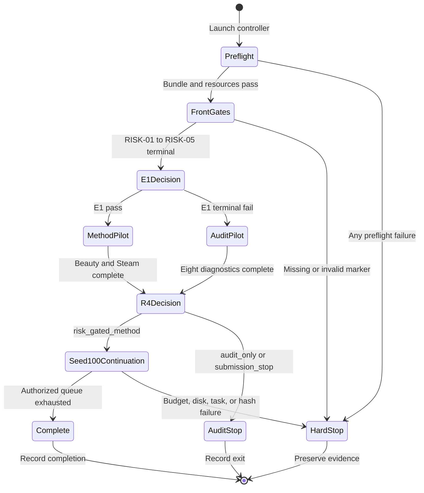

# AAAI-27 Seed-100 Resident Queue Design

_User-approved server-resident orchestration design for the evidence-risk rescue program, frozen on 2026-07-10._

---

## 📋 Decision summary

This design defines a resumable, fail-closed experiment controller that runs entirely on the `l20` server. After one detached launch, the user's local computer may disconnect or power off without interrupting the controller or its child experiments.

The design is subordinate to the [AAAI-27 evidence-risk rescue design](2026-07-10-aaai27-evidence-risk-rescue-design.md) and its [primary execution ledger](../../../issues/2026-07-10_21-18-20-aaai27-evidence-risk-rescue.csv). It does not create new scientific experiments, alter acceptance criteria, or authorize work outside that ledger.

The following decisions are frozen:

1. Every newly launched training or corruption task uses `seed=100`; seeds `101/102` are outside this queue.
2. The controller runs inside a detached `tmux` session on `l20`; no `sudo`, system service, or continuously connected client is required.
3. Each L20 hosts at most one training process at a time.
4. Every run uses a new dated, isolated directory and cannot overwrite Gate-1, SPRINT-07, CLOSE-10, historical Table 2, DiffuRec, or any stale/partial artifact.
5. An E1 terminal failure automatically selects the approved audit-only branch: Beauty and Steam each run one shared host plus three `text_anchor_only` corruption conditions at seed 100, for eight diagnostic runs total.
6. The E1-fail branch never launches `risk_gated_full`, never launches the host/full matched matrix, and stops after the RISK-08 audit-only or submission-stop decision is recorded.
7. If E1 passes and RISK-08 selects `risk_gated_method`, the controller automatically continues the authorized seed-100 downstream queue.
8. Automatic continuation has a hard forecast-and-usage ceiling of seven cumulative GPU-days and requires at least 40 GiB free under `/data` before each new wave.
9. BERT4Rec, rescue tuning, repeat attempts, alternative thresholds, and seeds `101/102` are disabled.
10. DiffuRec is never queued as a confirmatory baseline. RISK-11 may run only a separately audited, correctly identified DiffRec implementation.
11. Generating this spec and its implementation plan does not authorize remote deployment or experiment launch. Deployment requires a later explicit user instruction.

## 🎯 Goals and non-goals

### Goals

- Keep all scheduling, logs, state, and recovery information on `l20`.
- Survive client disconnects and local-computer shutdowns.
- Express RISK-01 through RISK-14 dependencies and branch gates without researcher intervention.
- Prevent duplicate runs, GPU oversubscription, stale-artifact reuse, and accidental overwrite.
- Preserve exact code, configuration, data, bank, evaluator, selector, checkpoint, and runtime provenance.
- Stop dependent tasks on any missing marker, nonzero exit, resource violation, or provenance mismatch.
- Permit a safe restart of the controller after a server or tmux interruption.
- Make the queue inspectable through a concise status command and append-only event log.

### Non-goals

- Implementing the scientific contents of RISK-01 through RISK-14.
- Repairing optimizer ownership automatically.
- Selecting risk definitions, thresholds, controls, or hyperparameters after observing pilot results.
- Treating tmux-session disappearance as sufficient evidence of task completion.
- Killing a currently running experiment merely because a stop request was created.
- Automatically pushing Git changes, editing the paper, or adding new ledger rows.
- Closing RISK-13 after only its seed-100 wave; the ledger row still requires seeds `100/101/102` for full completion.
- Guaranteeing that every seed-100 downstream task fits within 48 hours.

## 🔎 Verified starting conditions

The following observations were collected read-only from `l20` at approximately `2026-07-10 21:38 +08:00`. They are an audit snapshot, not permanent assumptions.

| Item | Observed value | Design consequence |
| --- | --- | --- |
| Host | `ubuntu` | Remote launcher must verify hostname before mutation |
| GPUs | 2 × NVIDIA L20, 46,068 MiB each | Controller exposes exactly two GPU worker slots |
| GPU use | 9 MiB and 0% utilization on both cards | Both cards were free at observation time |
| Active tmux | None | No existing session needed intervention |
| CLOSE-10 | Seeds 100/101/102 have summaries and best checkpoints | CLOSE-10 is treated as frozen input, never as queue work |
| CLOSE-10 latest release | Seed 102 log/checkpoints completed around `13:51 +08:00` | Both cards had already been released |
| `/data` | 87 GiB available, 82% used | The 40 GiB start-wave disk gate is necessary |
| `RecDemoRuns` | Approximately 67 GiB | Checkpoint retention must remain best plus latest only |
| Remote PreferGrow revision | `15ad50591fad` | It cannot be assumed to contain the local rescue design or future controller |
| Local rescue-plan revision | `90759d4` | Deployment must use a newly pinned, clean execution snapshot |
| Current E1 result | Step-0 optimizer-membership failure | `risk_gated_full` remains unauthorized until a new amendment trace passes |

The current E1 evidence is the [production-path hard-stop memo](../../reports/data/2026-07-10-e01-gzero-production-trace/e01_gzero_hard_stop_zh.md). Its earliest divergence is `core_proposal_logits.in_optimizer` at step 0. The controller may consume a later E1 terminal marker, but cannot reinterpret or overwrite the archived trace.

## ⚙️ Architecture

### Components

| Component | Responsibility | Mutation scope |
| --- | --- | --- |
| Remote launcher | Verify host and immutable bundle, then create or inspect the tmux session | Queue root only |
| Controller | Resolve dependencies, branch gates, budgets, disk checks, and worker assignment | State, markers, logs |
| GPU workers | Execute one argv-based training task on one locked GPU | Assigned isolated run directory |
| CPU worker | Execute bounded evaluator, bank, analysis, and gate tasks | Assigned artifact directory |
| Manifest validator | Reject incomplete, inconsistent, or unapproved queue definitions | None during validation |
| Status command | Render task, gate, GPU, budget, and artifact status | Read-only |
| Stop command | Create `STOP_AFTER_CURRENT` | State directory only |

The controller is generic infrastructure. A scientific row becomes runnable only after its adapter supplies a complete task manifest and passes adapter tests. A missing adapter is a `blocked` state, not permission to synthesize a command.

### Server layout

```text
/data/Zijian/goal/RecDemoRuns/
└── aaai27_seed100_resident_<YYYYMMDD-HHMMSS>/
    ├── bundle/
    │   ├── source_manifest.json
    │   ├── queue_manifest.json
    │   └── SHA256SUMS
    ├── queue/
    │   └── queue_seed100.json
    ├── state/
    │   ├── controller.json
    │   ├── controller.lock
    │   ├── gpu0.lock
    │   ├── gpu1.lock
    │   ├── gpu0.current.json
    │   ├── gpu1.current.json
    │   └── STOP_AFTER_CURRENT
    ├── markers/
    │   ├── RISK-01_PASS.json
    │   ├── RISK-02_PASS.json
    │   ├── RISK-02_FAIL.json
    │   ├── RISK-04_PASS.json
    │   ├── RISK-05_PASS.json
    │   └── RISK-08_EXIT.json
    ├── logs/
    │   ├── controller.log
    │   ├── events.jsonl
    │   ├── gpu0_worker.log
    │   └── gpu1_worker.log
    ├── manifests/
    │   └── <task-id>.json
    └── runs/
        └── <ledger-id>/<dataset>/<arm>/seed100/
```

The dated root is immutable in identity after launch. Resume operations reuse the same root and manifest; a materially changed queue requires a new dated root.

## 🔄 Queue state machine



No edge in this state machine is inferred from a log substring alone. Every transition requires a schema-valid marker produced by the designated adapter and verified against the immutable queue manifest.

## 📋 Queue stages

### Stage 0: Immutable preflight

The launcher must complete all checks before creating the controller session:

1. Verify the SSH target resolves to the approved `l20` host and the remote hostname is `ubuntu`.
2. Verify the execution bundle has a pinned Git commit or content-addressed source manifest and no unrecorded source file.
3. Verify the rescue spec, primary ledger, queue manifest, evaluator, selector, and task adapters against `SHA256SUMS`.
4. Verify no queue root, frozen artifact, or run directory collision exists.
5. Verify two NVIDIA L20 devices are visible and no unknown training process owns either target GPU.
6. Verify `/data` has at least 40 GiB free.
7. Verify every enabled pre-RISK-08 task has a complete adapter and no unresolved command.
8. Run manifest validation and a no-op scheduling simulation for both E1 outcomes.

Any failure prevents tmux creation and records no experimental result.

### Stage A: Front gates

The first resident stage follows ledger dependencies:

```text
RISK-01 common evaluator and validation selector
    -> RISK-02 optimizer-ownership amendment trace
    -> RISK-03 train-only EPE/PNE reporting
    -> RISK-04 corruption banks and preflight
    -> RISK-05 prospective protocol freeze
```

Independent CPU work may overlap only when the ledger dependencies and artifact ownership do not conflict. GPU training does not begin before RISK-01 and RISK-05 pass and RISK-02 reaches a validated terminal outcome.

### Stage B1: E1-pass pilot

If `RISK-02_PASS.json` is valid, the controller schedules:

| GPU | Dataset | Runs | Arms |
| --- | --- | ---: | --- |
| GPU0 | Beauty | 7 | One shared host; `text_anchor_only` and `risk_gated_full` at 0%, 60%, 100% |
| GPU1 | Steam | 7 | One shared host; `text_anchor_only` and `risk_gated_full` at 0%, 60%, 100% |

All 14 runs use seed 100. Dataset assignment may change only if a preflight capacity check proves the same one-process-per-card contract and the queue manifest records the change before launch.

### Stage B2: E1-fail audit-only pilot

If `RISK-02_FAIL.json` is valid and no pass marker exists, the approved automatic fallback is:

| GPU | Dataset | Runs | Arms |
| --- | --- | ---: | --- |
| GPU0 | Beauty | 4 | One shared host; `text_anchor_only` at 0%, 60%, 100% |
| GPU1 | Steam | 4 | One shared host; `text_anchor_only` at 0%, 60%, 100% |

This branch has the following hard prohibitions:

- No `risk_gated_full` task may become ready.
- No optimizer-equivalence, fallback, no-harm, or method-performance marker may be generated.
- No automatic amendment, second seed, hyperparameter change, threshold change, or alternate risk statistic may run.
- RISK-08 may emit only `audit_only` or `submission_stop`.
- Every downstream training task remains blocked after RISK-08.

### Stage C: RISK-08 gate

The RISK-08 adapter consumes every required pilot outcome and the dated preregistration. It writes one atomic `RISK-08_EXIT.json` with exactly one allowed exit:

| Exit | Required upstream branch | Controller action |
| --- | --- | --- |
| `risk_gated_method` | E1 pass and method criteria pass | Enter automatic seed-100 continuation |
| `audit_only` | E1 terminal fail or method gate does not authorize a method claim | Preserve evidence and stop |
| `submission_stop` | Frozen stop criterion fires | Preserve evidence and stop |

An unknown exit value, ambiguous double marker, missing input, or modified preregistration is a hard failure.

### Stage D: Method-pass automatic continuation

Only `risk_gated_method` authorizes downstream work. The default priority order is:

1. RISK-13 seed-100 four-domain host/full matched pairs: eight runs.
2. RISK-14 seed-100 high-risk and low-risk mechanism controls.
3. RISK-10 SASRec, Caser, and GRURec on all four domains: twelve runs.
4. RISK-11 DiffRec on all four domains: four runs, conditional on identity and memory audits.

RISK-09 adapter completion may occur before RISK-08, but RISK-10 training cannot. RISK-11 likewise may perform a read-only identity and feasibility audit before RISK-08, but cannot launch training before the method-pass marker.

The priority order may be interleaved by the scheduler to reduce idle GPU time only when dependencies, atomic baseline groups, budget, and scientific priority remain unchanged. RISK-13 seed 100 is a partial wave and cannot close the full three-seed ledger row.

### Disabled work

The queue validator must reject any enabled entry matching one of these conditions:

- `seed` is not 100;
- model identity is DiffuRec;
- ledger ID is RISK-12 BERT4Rec;
- task requests a rescue retry or `max_attempts > 1`;
- task is not traceable to an existing rescue-ledger row;
- run directory resolves outside the dated queue root;
- command contains destructive overwrite flags;
- baseline group lists fewer than all four domains.

## 🧾 Task manifest contract

Each runnable unit is an argv-based task, not an interpolated shell command. Its manifest must include the following fields.

| Field | Requirement |
| --- | --- |
| `schema_version` | Exact controller-supported version |
| `task_id` | Globally unique within the dated queue |
| `ledger_id` | One of RISK-01 through RISK-14 |
| `phase` | `preflight`, `front_gate`, `pilot`, `decision`, or `continuation` |
| `branch` | `common`, `e1_pass`, `e1_fail_audit`, or `method_pass` |
| `kind` | `cpu`, `gpu`, or `contract_gate` |
| `argv` | Nonempty argument array with no shell evaluation |
| `cwd` | Absolute path inside the immutable source bundle or assigned run root |
| `env` | Explicit allowlist; secrets and inherited mutable variables are forbidden |
| `dependencies` | Task IDs that must be terminal-pass |
| `required_markers` | Gate markers and accepted values |
| `success_artifacts` | Exact files and validation rules required for pass |
| `failure_policy` | Always `fail_closed` for this queue |
| `max_attempts` | Exactly 1 |
| `gpu_slots` | 0 or 1; never greater than 1 |
| `gpu_hours_low/high` | Frozen scheduling estimate |
| `estimated_output_gib` | Used by disk preflight |
| `seed` | 100 for training and corruption; null only for non-random audits |
| `dataset` and `arm` | Explicit values or null for cross-domain contract tasks |
| `run_dir` | Unique directory below the dated root |
| `code_revision` | Pinned commit/content manifest identity |
| `config_sha256` | Required before readiness |
| `split_sha256` | Required for dataset-consuming tasks |
| `bank_sha256` | Required for evidence-consuming tasks |
| `evaluator_version` | Required for metric-producing tasks |
| `selector_version` | Required for checkpoint-selecting tasks |
| `atomic_group` | Baseline all-four group when applicable |

A task with a missing required value is `blocked_manifest`; it never enters `ready`.

## 🔐 Safety and isolation contracts

### GPU ownership

- The controller acquires `gpu<N>.lock` with a nonblocking OS file lock before spawning a GPU task.
- It performs a second `nvidia-smi` ownership check immediately before spawn.
- It sets a single visible device and records both physical and logical GPU IDs.
- The lock remains held by the worker supervisor until the child process and all descendants exit.
- An unknown process on the target GPU blocks scheduling; the controller never kills it.

### Filesystem isolation

- Every path is resolved before use and must remain below the dated queue root, except read-only dataset, frozen model, and source-bundle inputs.
- Symlink traversal outside permitted roots is rejected.
- The controller never accepts `--force`, recursive deletion, or an existing nonmatching run directory.
- Checkpoint retention is best plus latest only; snapshot accumulation beyond the task contract is a task failure.
- Existing summary files are reusable only when every manifest identity and success-artifact hash matches.

### Process handling

- Child processes start in their own process group for accurate observation, not for automatic termination.
- Exit code, start/end time, PID, process group, GPU, peak memory, and log paths are recorded.
- A nonzero exit, OOM signature, missing summary, or artifact validation failure produces a terminal fail marker.
- The default task timeout is disabled for training; progress is assessed from process liveness and structured heartbeat artifacts, not arbitrary wall-clock kills.

### Stop semantics

Creating `state/STOP_AFTER_CURRENT` prevents any new task from starting. Already running tasks are allowed to finish naturally. When all running tasks exit, the controller records `stopped_after_current` and terminates.

No ordinary stop action invokes `kill`, `pkill`, `tmux kill-session`, checkpoint deletion, or run-directory deletion.

## 💾 Resource and budget gates

### GPU budget accounting

Budget use is the sum of wall-clock seconds for each occupied GPU slot. A one-GPU task running 3 hours consumes 3 GPU-hours; two simultaneous one-GPU tasks running 3 hours consume 6 GPU-hours.

Before starting a task, the controller checks:

```text
actual_gpu_hours
+ frozen_high_estimate_of_candidate_task
<= 168 GPU-hours
```

`168 GPU-hours` equals the approved seven GPU-day hard ceiling. A task that would cross the ceiling remains `blocked_budget`; no lower post-hoc estimate may be substituted.

### Disk gate

Before every new scheduling wave, `/data` must have at least 40 GiB free. If free space falls below 40 GiB while tasks are running, those tasks continue, but no new task starts. The controller records `blocked_disk` and exits after current work completes unless a later explicitly authorized operator action restores capacity.

The controller does not delete checkpoints or artifacts to recover space.

### Expected wall clock

| Branch | Estimated cumulative GPU time | Two-L20 wall-clock range after adapters are ready |
| --- | ---: | ---: |
| Through RISK-08, E1 pass | 10–32 GPU-hours | 10–30 hours |
| Through RISK-08, E1 fail audit | 6–19 GPU-hours | 6–18 hours |
| Method-pass complete seed-100 queue | 81–165 GPU-hours | 45–90 hours |

The controller reports these as planning ranges, never as completion promises. Engineering, adapter implementation, and paper integration time are excluded.

## 🔁 Idempotency and recovery

### Launch behavior

The launcher never kills a same-name session. Its behavior is:

1. If the exact session and exact queue root are active, print status and exit successfully without a second controller.
2. If the session name exists with a different queue root or bundle hash, fail closed.
3. If no session exists but the queue state indicates unfinished work, start a recovery controller on the same root.
4. If the queue is terminal, print the terminal report and do not restart it.

### Recovery behavior

On startup, the controller:

1. Locks the controller state.
2. Validates the immutable bundle and queue hash.
3. Reconciles `running` records against live PIDs and process start times.
4. Marks an orphaned task `interrupted_unverified`; it is not retried automatically.
5. Revalidates all terminal-pass artifacts and markers.
6. Reconstructs ready/blocked states without changing the branch decision.
7. Resumes only tasks that never started and remain authorized.

Because `max_attempts=1`, an interrupted task requires explicit later authorization for any rerun. Re-running the launcher is recovery of the controller, not permission to repeat a scientific run.

## 🧪 Marker and evidence contract

Markers are JSON documents written to a temporary file, flushed, and atomically renamed. Each marker includes:

```json
{
  "schema_version": 1,
  "task_id": "RISK-02.trace.seed100",
  "ledger_id": "RISK-02",
  "status": "pass",
  "created_at": "2026-07-10T00:00:00+08:00",
  "queue_manifest_sha256": "<sha256>",
  "code_revision": "<revision>",
  "config_sha256": "<sha256>",
  "split_sha256": "<sha256-or-null>",
  "bank_sha256": "<sha256-or-null>",
  "exit_code": 0,
  "artifacts": ["<relative-path>"],
  "validation": {
    "result": "pass",
    "checks": ["<machine-readable-check>"]
  }
}
```

The concrete implementation must use real values; angle-bracket values above describe the schema and are not an executable marker.

For mutually exclusive gates such as RISK-02, simultaneous pass and fail markers are an integrity failure. The controller never resolves ambiguity by timestamp or preference.

## 📊 Status and audit interface

The status command is read-only and must report:

- queue root and immutable manifest hash;
- controller PID/session/liveness;
- selected branch and gate evidence;
- current GPU task per card, PID, elapsed time, and last heartbeat;
- pending, ready, running, passed, failed, blocked, and stopped task counts;
- actual and forecast GPU-hours;
- free `/data` space;
- latest event timestamp;
- exact run, log, marker, and summary paths;
- reasons for every blocked or failed task.

The append-only `events.jsonl` records state transitions. Human-readable logs may repeat information, but are never the source of truth for a gate.

## ✅ Acceptance criteria

The controller design is implementable only when all of the following can be verified in tests or a no-op remote smoke:

- A client disconnect does not affect a detached controller.
- Repeated launch does not duplicate, kill, or overwrite a task.
- GPU0 and GPU1 can each run one fake worker, while a second worker on either card is rejected.
- E1 pass schedules 14 pilot runs and permits only a valid RISK-08 method decision to unlock continuation.
- E1 fail schedules exactly eight audit-only runs, schedules zero `risk_gated_full` runs, and cannot unlock continuation.
- `audit_only` and `submission_stop` terminate without downstream training.
- `risk_gated_method` schedules only seed-100 RISK-13, RISK-14, RISK-10, and audited RISK-11 work.
- RISK-12, DiffuRec, seed 101, seed 102, retries, partial baseline groups, and destructive flags fail manifest validation.
- A seven-GPU-day forecast violation blocks the candidate task.
- Free `/data` space below 40 GiB blocks a new wave without killing current work.
- Missing, malformed, stale, ambiguous, or hash-mismatched markers fail closed.
- An interrupted running task becomes `interrupted_unverified` and is not retried automatically.
- Seed-100 RISK-13 output is labeled partial and cannot close the three-seed ledger row.
- Every successful task resolves to a CLI/argv, commit, config, split/bank hash, evaluator, selector, checkpoint, log, and summary.
- A dry run performs no remote mutation and prints the complete branch-aware schedule.
- A no-op tmux smoke uses an isolated temporary queue root and launches no training command.

## 🛡️ Authorization boundary

This approved design authorizes creation of a local spec and implementation plan. It does not authorize:

- writing controller files to `l20`;
- synchronizing a source bundle to `l20`;
- creating the remote queue root;
- creating a tmux session;
- launching evaluator, corruption, training, baseline, or analysis tasks;
- updating rescue-ledger execution statuses;
- pushing Git commits.

A later user instruction must explicitly authorize implementation execution and, separately or jointly, remote deployment and experiment launch.

## 🔗 Source documents

- [AAAI-27 evidence-risk rescue design](2026-07-10-aaai27-evidence-risk-rescue-design.md)
- [Primary evidence-risk execution ledger](../../../issues/2026-07-10_21-18-20-aaai27-evidence-risk-rescue.csv)
- [E1 production-path hard-stop memo](../../reports/data/2026-07-10-e01-gzero-production-trace/e01_gzero_hard_stop_zh.md)
- [CLOSE-10 launcher reference](../../../scripts/launch_close10_atg_noise_floor_tmux.py)
- [SPRINT-05 orchestrator reference](../../../scripts/sprint05_official_orchestrator.sh)
- [SPRINT-05 watchdog reference](../../../scripts/sprint05_watchdog.sh)

---

_Last updated: 2026-07-10 | Status: user-approved design, not deployed_
