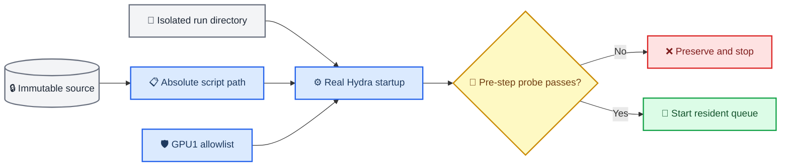

# R6 runtime launch-contract design

_PreferGrow AAAI-27 · 2026-07-11 · approved recovery design after the immutable r5 pre-training failure_

---

## 📋 Context and decision

r5 passed an object-level smoke but failed when the real Hydra subprocess tried to create `single_train.log` in an immutable source-root `cwd`. Its manifest also encoded `gpu_ids=[0,1]` despite a GPU1-only authorization. The dated r5 audit proves seven pre-training failures, one GPU0 dispatch, zero steps, zero checkpoints, zero summaries, and no performance evidence.

The approved successor is a new r6 attempt built from a new commit and immutable source. r5 is not patched, retried, resumed, or reused. The scientific contract remains unchanged: seed 100, Beauty/Steam pilot matrix, corruption assets, six `phi_R` values, host/evidence identities, validation-only selector, evaluator, `max_attempts=1`, and fail-closed policy.

## 🔍 Alternatives considered

| Approach | Benefit | Fatal limitation | Decision |
| --- | --- | --- | --- |
| Retry r5 after changing permissions | Minimal edit | Violates immutable attempt, no-retry, and provenance contracts | Rejected |
| Keep source `cwd` and disable Hydra file logging | Avoids the immediate exception | Treats the symptom, leaves relative writes and source/run identity ambiguous | Rejected |
| Separate source identity from runtime state | Makes every relative write isolated and auditable; supports a real startup probe | Requires coordinated adapter, validator, runtime, launcher, and test changes | Selected |

## ⚙️ Component contracts

### Manifest and task identity

- The RISK-06/RISK-07 protocol carries an explicit nonempty `gpu_ids` allowlist; r6 freezes it to `[1]`
- `build_pilot_manifest` copies the allowlist without a hidden `[0,1]` default
- Every GPU task has `cwd == run_dir`
- `argv[0]` is the absolute Python executable and `argv[1]` is the absolute immutable `single_train.py`
- `work_dir=<run_dir>` remains exactly one Hydra override
- The validator rejects GPU `cwd/run_dir` divergence and unsafe GPU allowlists

### Runtime containment and occupancy

- `QueueRuntime` resolves `task.cwd` within `queue_root`, creates it before `Popen`, and refuses paths outside the queue
- `ProcessSupervisor` continues to use `shell=False`, an environment allowlist, redirected task logs, and a new process session
- `probe_gpu_pids` retains the dynamically verified `--id=<physical-id>` filter
- Empty probe output means idle; every nonempty row must be a positive integer PID, otherwise the probe raises `GpuBusyError`
- The controller can only pass the manifest allowlist to the runtime; an idle but disallowed GPU is never considered

### Launcher integration

- The local launcher distinguishes the Python/entry used to invoke the remote tmux helper from the Python/entry the helper uses for the resident controller
- Its remote command always includes `--python-bin <absolute path>` and `--controller-entry <absolute path>`
- r6 passes the immutable source's `scripts/aaai27_resident_queue.py`; no mutable bundle path is inferred

### Continuation adapter and CPU contract gate

- The method-pass continuation adapter consumes the protocol's explicit `gpu_ids` and rejects every value other than `[1]` for this r6 attempt.
- Continuation GPU tasks use `cwd == run_dir` and keep the same absolute source-entry and `work_dir=<run_dir>` contract as the pilot adapter.
- A CPU `contract_gate` is intentionally different: it may execute from the existing immutable source root because it has `gpu_slots=0` and does not create a training run. The runtime applies queue-root containment and cwd/run-dir equality only to GPU tasks; the validator still checks the CPU gate's allowed source or queue root.
- This CPU exception is an orchestration precondition, not a scientific result and not permission to place a GPU task in the source root.

### Real Hydra startup probe

- `training.startup_probe_only` defaults to `false`
- With the flag enabled, the normal Hydra-decorated `single_train.py` completes logging setup, runtime dataset reconciliation, graph/model/noise construction, optimizer composition, EMA construction, strict text-bank/null/`phi_R` loading, and state creation
- It exits immediately after verifying `state.step == 0`, empty optimizer state, and absence of checkpoint/summary files
- It does not construct or iterate train/validation/test dataloaders, build sampling functions, call `optimizer.step`, evaluate metrics, or write checkpoints/summaries
- It exclusively creates `startup_probe.json` inside the dedicated probe run directory and prints `STARTUP_PROBE_PASS`; a pre-existing marker fails closed
- Scientific queue manifests reject `training.startup_probe_only=True`; the flag is for the separate prelaunch engineering probe only

## 🛡️ Failure handling

Any invalid path, GPU allowlist, unknown occupancy row, launcher argument omission, pre-existing probe artifact, nonzero startup state, optimizer state entry, checkpoint/summary file, or nonzero probe exit blocks r6 controller creation. A live mismatch after controller start triggers `request-stop`; there is no retry within the same attempt.

The real startup probe is engineering evidence only. It cannot be described as training success, model performance, or RISK-08 evidence.

## 🧪 Verification matrix

| Layer | Required proof |
| --- | --- |
| Adapter | `[1]`, `cwd==run_dir`, absolute Python/script, unchanged 22-task scientific matrix |
| Validator | Accept safe single-GPU allowlist; reject empty/duplicate/negative IDs and GPU cwd mismatch |
| Runtime | Create absent contained cwd; reject external cwd; fail on unknown probe rows |
| Launcher | Exact remote argv includes both required controller arguments |
| Startup probe unit | Real main initialization boundary returns before dataloader and writes one scoped artifact |
| Remote integration | Real Hydra command on l20 exits `0`, writes its log/artifact in probe run dir, and leaves step/checkpoint/summary counts at zero |
| Regression | Focused adapter/queue/checkpoint suites, `compileall`, `git diff --check`, manifest audit |

The continuation adapter and CPU contract-gate exception are covered by the continuation and runtime regression suites; they do not alter the scientific matrix.

## 🚫 Non-goals

- No scientific hyperparameter, seed, dataset, corruption, `phi_R`, selector, evaluator, model identity, or stopping rule changes
- No r3/r4/r5 deletion, permission mutation, restart, retry, or artifact reuse
- No GPU0 queue work, even if GPU0 later becomes idle
- No metric evaluation or performance wording in the startup probe
